# 配置Dataverse
+ Dataverse就是一个关系型数据库+Web管理界面。Dataverse和所有的关系型数据库一样，需要定义table、relationship（也叫外键或foreign key或reference key）、view。
+ Dataverse还提供了更丰富的功能，包括创建Chart、导入导出数据。

## 标准表
+ 新建环境后，是没有database的，这时只能创建canvas app。管理员可以安装database。
+ database时，自带了一些表，比如Account、Contact、User，这些叫standard tables。标准表不可以删除只可以隐藏。
+ 隐藏标准表的方式：就是让所有人都看不到这个表，需要修改所有security roles，将Read权限改为None，但在 Maker Portal 仍然可以看到这个表。

## 新建table（entity）
+ table之前叫entity
+ table type有两种：Standard table和Activity table。
+ Activity table 的 ownership 只能是`User or team`，比如给员工分配的任务、比如预约的会议，都可以作为Activity类型。Activity可以显示在timeline上。示例Activity表：Appointment Email Fax Letter PhoneCall RecurringAppointmentMaster。
+ Standard table的 ownership 有2个选项：`User or team`和`Organization`。
+ 两种ownership的区别：ownership会影响`Security Role`中可选的access level和privileges。如果选择`User or team`，则access level有5种(`None Selected;Users;Business Unit; Parent:Child Business Units;Organization`)，privilege有8种；如果选择`Organization`，则access level只有2种(`None Selected;Organization`)，privilege有6种（缺少了Assign和Share）。
+ ===
+ 新建table时需要选择ownership：
+ 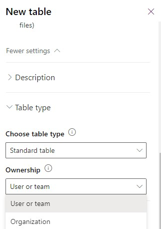
+ privilege和access level：
+ 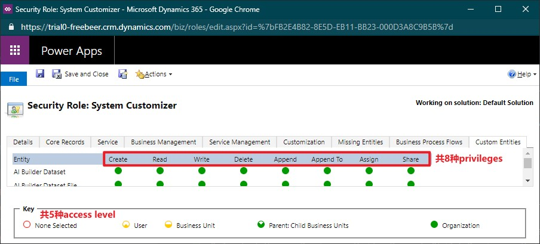
+ 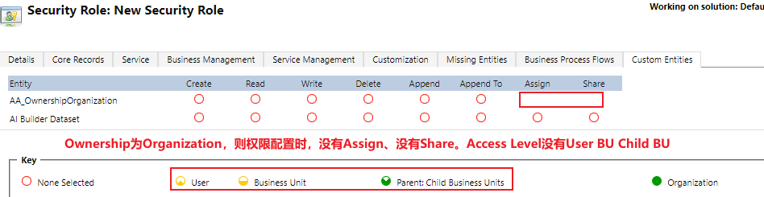

## 配置columns
+ columns之前叫fields，有些文档中也称作attribute、property
+ 新建column时需要选`Data type`，大部分都很容易理解，这里只描述几个不容易理解的type：Lookup类型、Owner类型、Customer类型、PartyList类型。
+ Lookup类型的字段。类似于单选，但单选是从“固定的列表”中选择一个，Lookup是从”特定的表“中选择一个。比如一个网购订单，订单的”卖家字段“就是Lookup字段。在数据库中存储的的是一个整数GUID。
+ Owner类型的字段。一种特殊的Lookup字段。当表的ownership为`User or team`时，会自动添加一个`owner`字段，它的DataType是`Owner`。在选择时，可以选择User表中的一个user，也可以选择Team表中的一个team。在底层数据库中实际会占用两个字段(`ownerid`和`owneridtype`)，但在web端只能看到一个字段`ownerid`。（通过API可以看到`owneridtype`）
+ Customer类型的字段。一种特殊的Lookup字段。在选择时，可以选择Account表中的一个account，也可以选择Contact表中的一个contact。在底层数据库中实际会占用两个字段
+ PartyList类型的字段。支持多选的Lookup字段。比如会议有多个参会人，参会人字段就可以是PartyList。`Appointment`表的`requiredattendees`字段就是PartyList类型。这种字段一般是系统创建。PartyList字段可以从Account、User、Contact、Queue中进行选择。PartyList在底层数据库中实际是用了2个中间表（`activityparty`和`activitypointer`，用API可以看到）。
+ ===
+ Owner字段：
+ 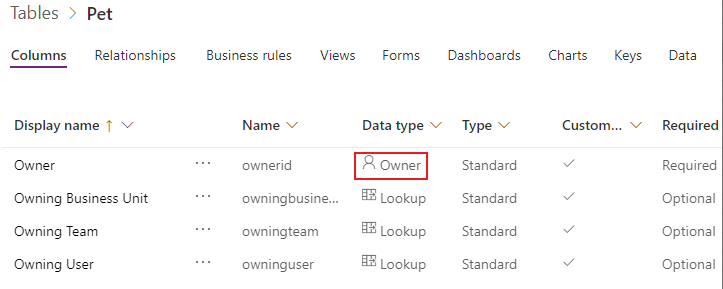
+ Owner字段可以从两个table中选择记录：
+ 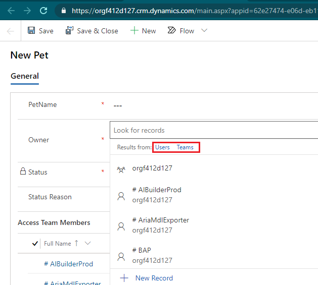
+ PartyList字段可以从6个table中选择记录：
+ 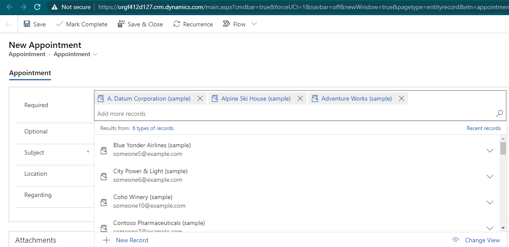

### calculated field 与 rollup field
+ `rollup field` 会写入db，需要system job定时执行，第一次配置后需要等待一段时间（12小时执行一次）。可以跨多个entity，比如可以记录一个公司有多少个员工。可以使用aggregate function（如COUNT SUM）
+ `rollup field` 的 字段类型 只能是 number。不可以是 文本、单选 类型。
+ `calculated field` 不写入到db，它是**读取数据时用sql语句计算出来**的。
+ `calculated field`只能是 文本、number 类型。不可以是Lookup、单选、多选、图片。
+ 字段的Data Type和Field Type创建后是不可以修改，如果错了只能删掉:
+ 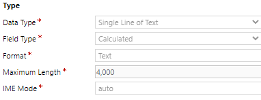

### calculated field
+ form不会对`calculated field`做特殊处理，修改form中的其他字段，`calculated field`不会动态修改，点击保存后`calculated field`的值才会变化。
+ calculated field**不需要定时任务**。它是只读的，这个字段并不会写入到db中，而是每次**读取时用sql语句计算出来**的。
+ 使用场景： 有first name、last name，自动获得full name。有一个datetime字段，自动获取date。
+ calculated field在form中有一把锁头，表示readonly：
+ 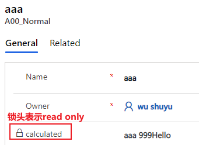
+ calculated field designer截图：
+ 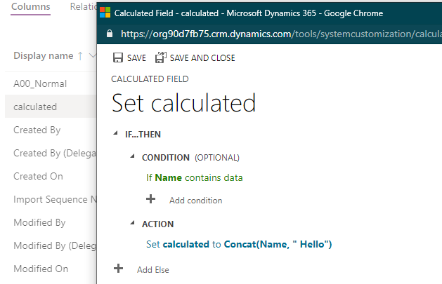

## 配置relationship
+ 参考附录2

## 配置business rules
+ 注意和`BPF（Business Process Flow）`区分！
+ BPF是在Web界面上的创建向导，一步步**引导用户**先输入什么、再输入什么、最后完成创建直接保存。编辑时不使用BPF。
+ business rule用于**提高数据质量**，不合格的数据直接拦在外面，不写入db。business rule需要定义condition，以及condition满足后执行的哪些actions。
+ 编辑business rule的时候，注意右上角的scope，scope有3个选项：Entity、All Forms、Specific Forms。
+ Specific Forms不是一个选项，而是多个选项，有多少个main form，就有多少个选项。刚创建时，只有一个`Information Form`。
+ 如果Scope为 a specific Form，则**仅这个main form**中会触发此business rule。canvas app中不会触发此business rule。
+ 如果Scope为All Forms，则**所有main form**中都会触发此business rule。canvas app中不会触发此business rule。
+ 如果Scope为Entity，则**所有main form**中都会触发此business rule，所有保存操作都**会在server端触发**，包括:canvas app中保存时，API创建的记录、导入的记录。
+ 在server端触发时，不支持这三个actions：Set Visibility; Lock/Unlock; Recommendation。Model-Driven中支持所有的action。
+ 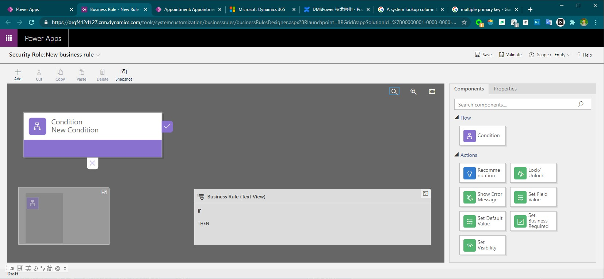

## 配置views
+ 可以配置显示哪些列（列宽），配置排序方式，配置查询条件。
+ 不仅可以配置当前table中的列，还可以配置parent table中的列。比如在order列表中直接显示seller的地址。
+ 在Model-Driven app中可以切换view，如图:
+ 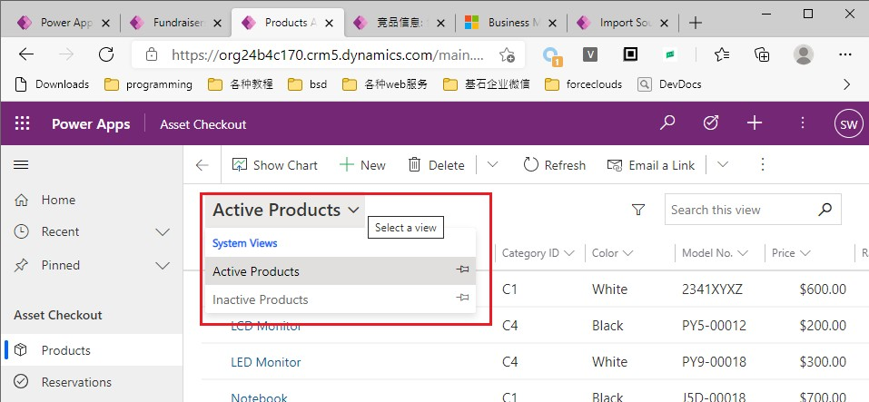
+ view按创建者分类，可以分为两种：system views、user views。见下图：
+ 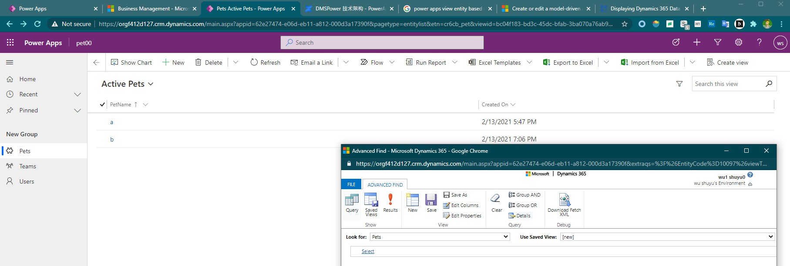
+ 用户创建的views是可以分享的，如图：
+ 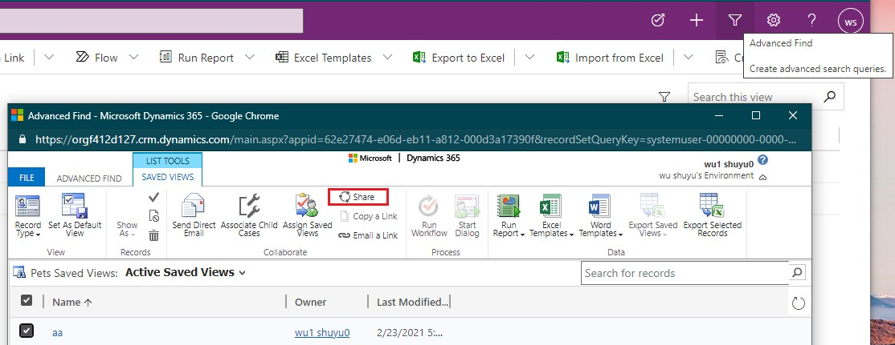

## 配置forms
+ form用于显示一条记录的详细内容
+ form有4种类型：Main Form、Quick View Form、Quick Create Form（默认不可以创建）、Card Form
+ Quick Create Form默认不可以创建，需要在table的setting中开启，开启方式如下：
+ 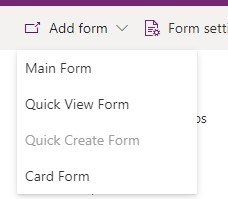  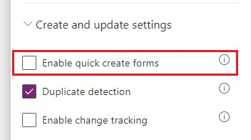
+ quick view form可以嵌入在main form中。比如这个需求：”在Contact的详情页直接查看所属公司“，操作方法：在`Contact`的Main Form中嵌入Account的Quick View Form。
+ Quick Create Form通过右上角的加号打开，效果如图:
+ 
+ Card Form比较少见，它是Dashboard页面的related list中的一个row。左侧有一个ColorStrip（只能放单选字段），有title和subtitle，Footer可以折叠展开。效果如图：
+ 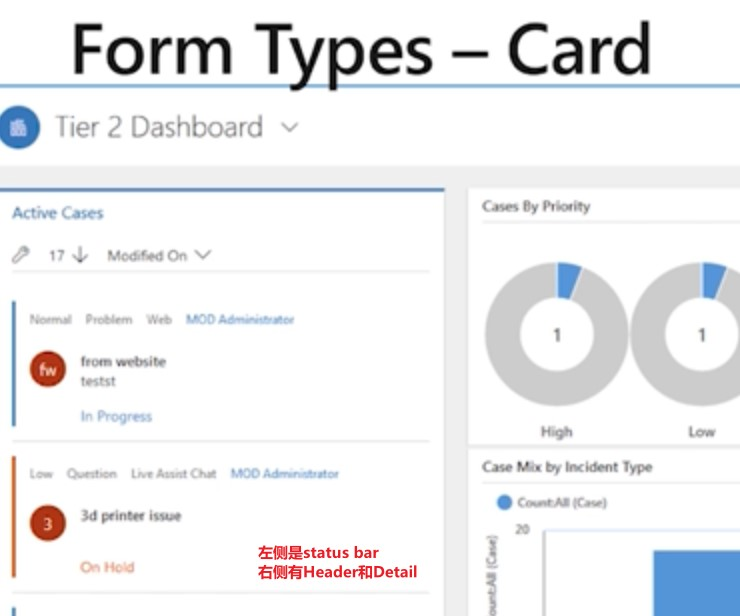
+ 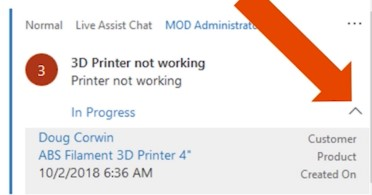
+ 有两种designer，classic form designer功能更多；morden designer可以实时预览。
+ morden form designer：
+ 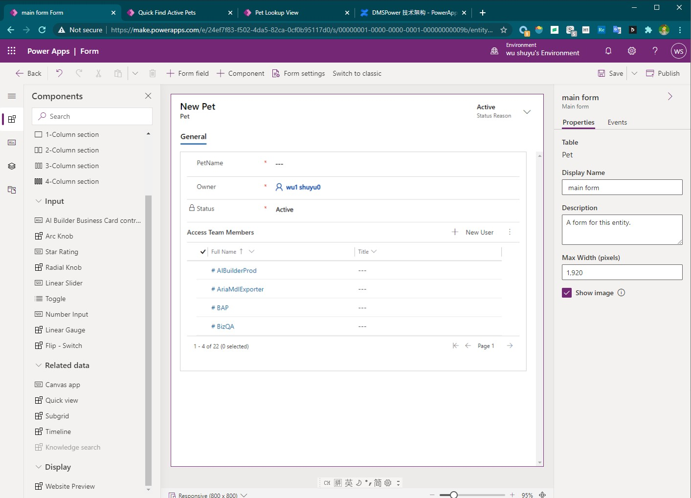
+ classic form designer:
+ 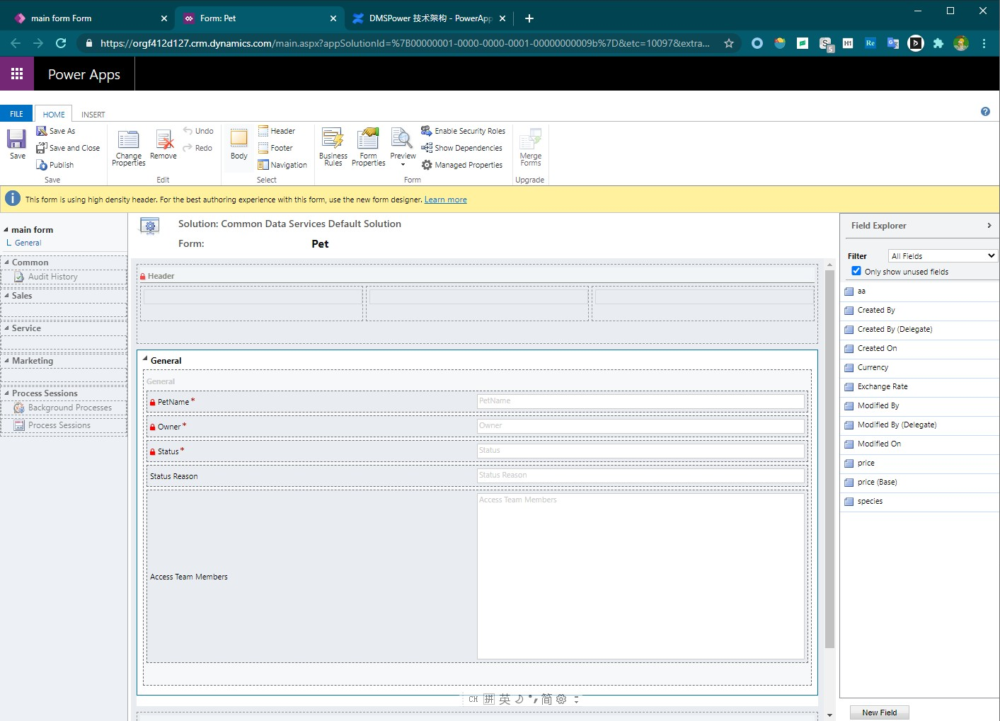

### 配置main form
+ main form从上到下分为三个部分：header body footer。
+ body中可以添加n个tabs，tab中可以添加n个sections。sections可以分为多列。一般只有一个tab。
+ 开发者的工作就是向form中添加form field。form field有label，label可以隐藏，form field可以设置为readonly的，左侧会多一把锁头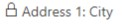。
+ field有data type，Form Designer会根据data type自动选择control
+ 使用business rule可以动态隐藏field

### 设置 form 权限、fallback form
+ security role 不仅可以控制用户对entity的访问，还可以控制用户对form的访问。
+ 在Form Setting处，可以设置仅某几个security roles可以看到这个Form。如果做了这个限制，就会出现一种情况，有个用户可以访问entity，但不能访问form。
+ 为了避免出现这种情况，必须设置一个fallback form，当根据security roles找不到form时，使用这个fallback form进行显示。
+ 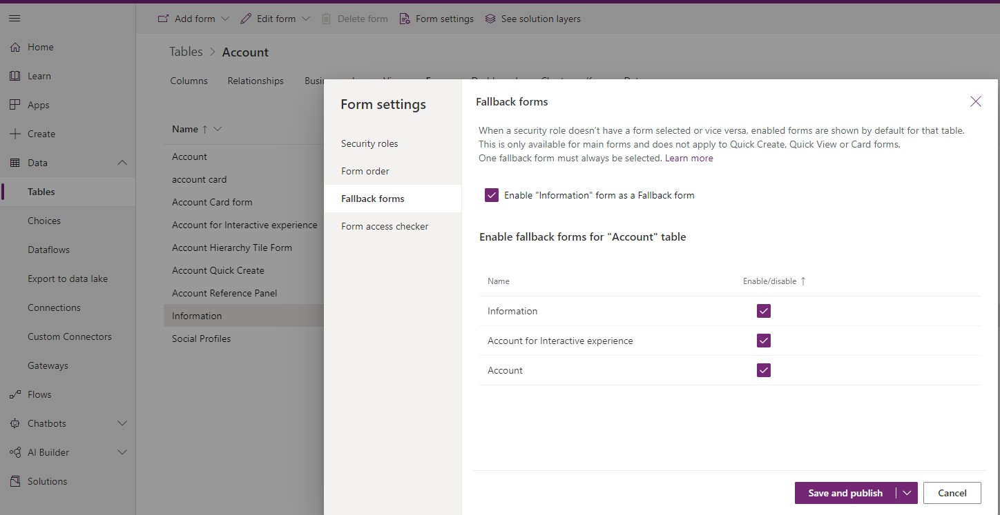

## 配置dashboard
+ dashboard是仪表盘，就是 **分类**汇总 呈现出来，页面中有chart、list。
+ dashboard按创建方式分类，可分为以下三种：
+ 第一种：entity处配置的single-stream interactive dashboard
+ 第二种：app designer中配置的classic dashboard
+ 第三种：app designer中配置的interactive dashboard，可以是single-stream，也可以是multi-stream
+ app designer截图：
+ 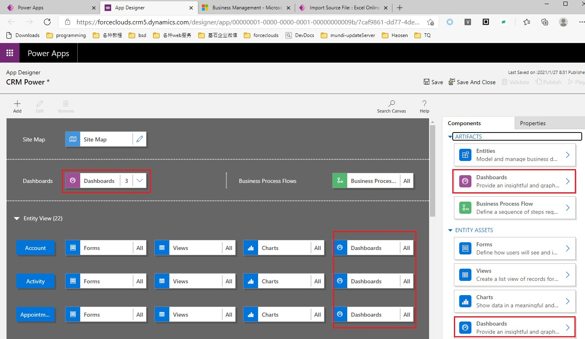
+ 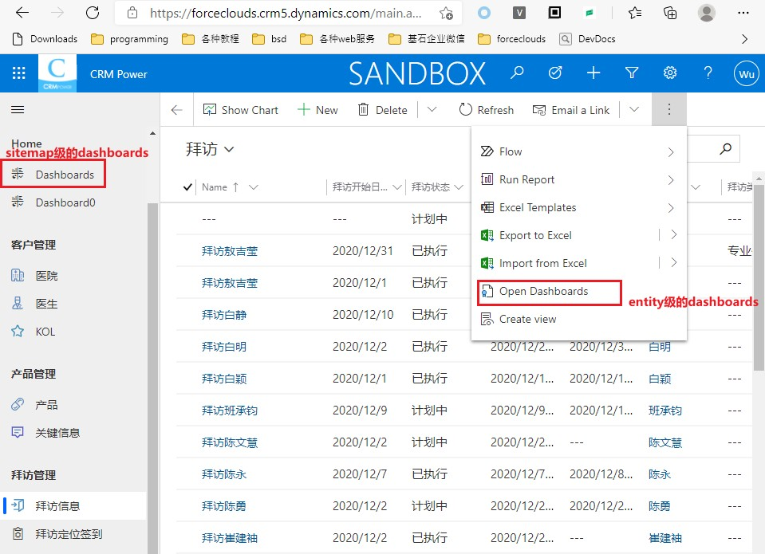
+ app designer中新建dashboard的两种类型：
+ 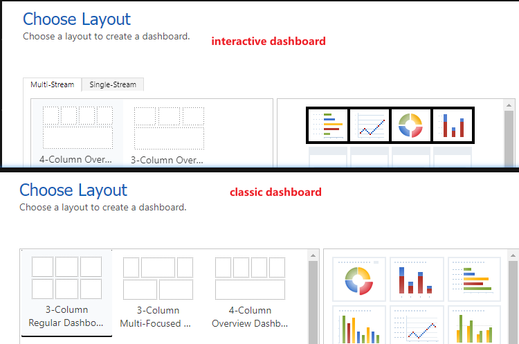

### classic dashboard vs interactive dashboard
+ classic dashboard仅支持单chart下钻，下钻一个chart其他chart不会联动。interactive dashboard 下钻时，多个chart是联动的。
> 什么是下钻（drill down）？ 比如一个跨国连锁超市，初始以国家分组看销售额，点击国家后，可以以省份分组看销售额，点击省份后，可以以门店分组看销售额。这就叫下钻，逐渐细化。
+ classic dashboard 中只可以添加chart和view
+ interactive dashboard 中也有chart和view，但把chart叫做Visual Filters，把view叫做streams。visual filter下钻后会影响streams显示。
> stream和view的区别：view中要想细化，需要手动输入 Advanced filters 参数；stream细化依靠点击visual filter中的分组 

### system dashboard vs user dashboard
+ dashboard按创建者分类，可以分为两种：system dashboards、user dashboards。见下图：
+ 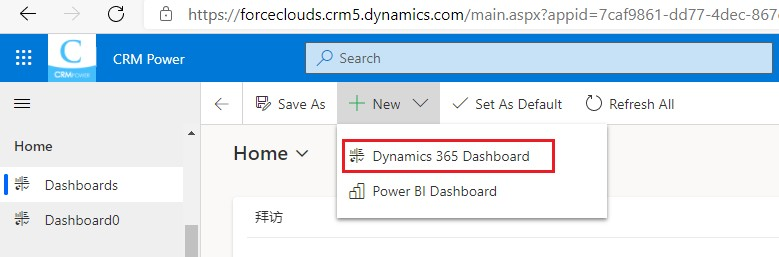 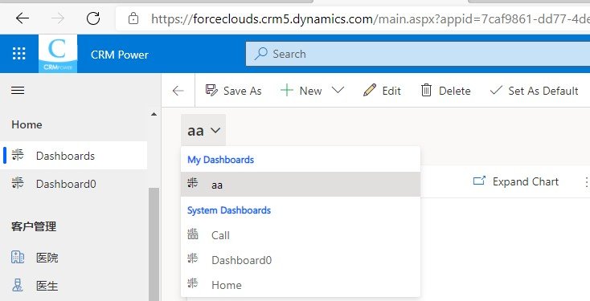

## 配置chart
+ chart就是**分组**统计。下图是拜访统计，先选择一个view（这是datasource），然后需要从datasource中抽出一组数字，这组数字叫做series，图中的series是`300 4 28 53`。
+ 每个series中的值，都需要有一个label（或叫category）来标记这个数字是什么意思。
> 注意：label并不一定位于horizontal Axis（x轴），如果是Bar Chart，label位于vertical axis（y轴）。Designer中的用词不准确。
+ 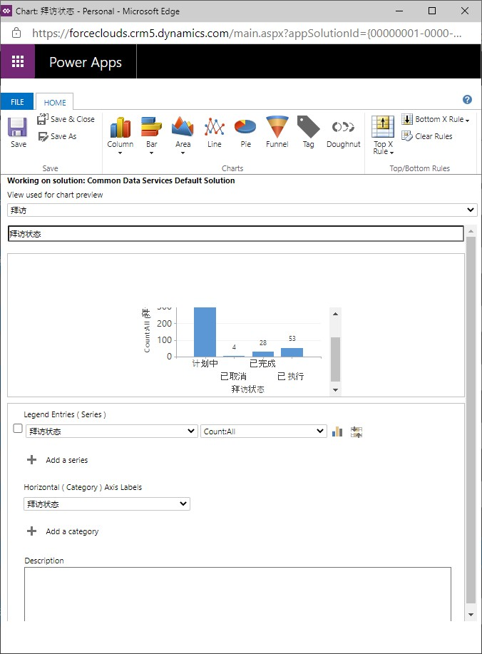

## 配置Alternate Key
+ Alternate Key实际是Alternate primary key，必须是Unique的。
+ alternate key可能创建失败，`Morden PPac`中看不到创建状态，在`legacy PPac`中可以看到创建状态。

## 在Maker Portal中管理Data
+ 在Data标签处，显示的不是所有数据! **在右上角可以修改View**
+ 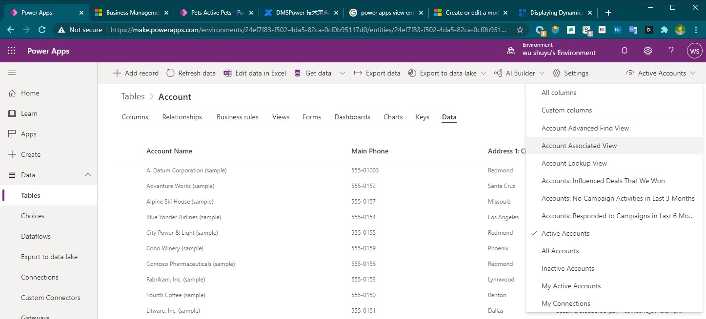
+ 在这里可以导入数据、导出数据，但没有Model-Driven中友好，建议**不要通过这个界面导入导出**，而是创建一个Model-Driven app，在 md app 中执行导入导出。
+ 这里可以显示 `All columns`，这是 md app 中没有的功能。
+ 在这里可以新建和删除，

