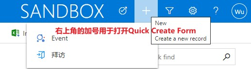

# 配置Dataverse
+ Dataverse就是一个关系型数据库+Web管理界面。和所有的关系型数据库一样，需要定义table、relation（也叫外键或foreign key或reference key）、view、stored procedure。
+ 在mysql中，stored procedure是一个函数，需要用SQL调用。在Dataverse中，stored procedure是以Business rules的形式提供的。

## 新建table（entity）
+ table之前叫entity
+ table type有两种：Standard table和Activity table。
+ Activity table 的 ownership 只能是`User or team`，比如给员工分配的任务、比如预约的会议，都可以作为Activity类型。Activity可以显示在timeline上。
+ Standard table的 ownership 有2个选项：`User or team`和`Organization`。
+ 两种ownership的区别：ownership会影响`Security Role`中可选的access level和privileges。如果选择`User or team`，则access level有5种(`None Selected;Users;Business Unit; Parent:Child Business Units;Organization`)，privilege有8种；如果选择`Organization`，则access level只有2种(`None Selected;Organization`)，privilege有6种（缺少了Assign和Share）。
+ ===
+ 新建table时需要选择ownership：
+ 
+ privilege和access level：
+ 
+ 

## 配置columns
+ columns之前叫fields，有些文档中也称作attribute、property
+ 新建column时需要选`Data type`，大部分都很容易理解，这里只描述几个不容易理解的type：Lookup类型、Owner类型、Customer类型、PartyList类型。
+ Lookup类型的字段。类似于单选，但单选是从“固定的列表”中选择一个，Lookup是从”特定的表“中选择一个。比如一个网购订单，订单的”卖家字段“就是Lookup字段。在数据库中存储的的是一个整数GUID。
+ Owner类型的字段。一种特殊的Lookup字段。当表的ownership为`User or team`时，会自动添加一个`owner`字段，它的DataType是`Owner`。在选择时，可以选择User表中的一个user，也可以选择Team表中的一个team。在底层数据库中实际会占用两个字段(`ownerid`和`owneridtype`)，但在web端只能看到一个字段`ownerid`。（通过API可以看到`owneridtype`）
+ Customer类型的字段。一种特殊的Lookup字段。在选择时，可以选择Account表中的一个account，也可以选择Contact表中的一个contact。在底层数据库中实际会占用两个字段
+ PartyList类型的字段。支持多选的Lookup字段。比如会议有多个参会人，参会人字段就可以是PartyList。`Appointment`表的`requiredattendees`字段就是PartyList类型。这种字段一般是系统创建。PartyList字段可以从Account、User、Contact、Queue中进行选择。PartyList在底层数据库中实际是用了2个中间表（`activityparty`和`activitypointer`，用API可以看到）。
+ ===
+ Owner字段：
+ 
+ Owner字段可以从两个table中选择记录：
+ 
+ PartyList字段可以从6个table中选择记录：
+ 

## 配置relationship
+ 参考附录2

## 配置business rules
+ 注意和`BPF（Business Process Flow）`区分！
+ BPF是在Web界面上的创建向导，一步步**引导用户**先输入什么、再输入什么、最后完成创建直接保存。编辑时不使用BPF。
+ business rule用于**提高数据质量**，不合格的数据直接拦在外面，不写入db。business rule需要定义condition，以及condition满足后执行的哪些actions。
+ 编辑business rule的时候，注意右上角的scope，scope有3个选项：Entity、All Forms、Specific Forms。
+ Specific Forms不是一个选项，而是多个选项，有多少个main form，就有多少个选项。刚创建时，只有一个`Information Form`。
+ 如果Scope为 a specific Form，则**仅这个main form**中会触发此business rule。canvas app中不会触发此business rule。
+ 如果Scope为All Forms，则**所有main form**中都会触发此business rule。canvas app中不会触发此business rule。
+ 如果Scope为Entity，则**所有main form**中都会触发此business rule，所有保存操作都**会在server端触发**，包括:canvas app中保存时，API创建的记录、导入的记录。
+ 在server端触发时，不支持这三个actions：Set Visibility; Lock/Unlock; Recommendation。Model-Driven中支持所有的action。
+ 

## 配置views
+ 可以配置显示哪些列（列宽），配置排序方式，配置查询条件。
+ 不仅可以配置当前table中的列，还可以配置parent table中的列。比如在order列表中直接显示seller的地址。
+ 在Model-Driven app中可以切换view，如图:
+ 

## 配置forms
+ form用于显示一条记录的详细内容
+ form有4种类型：Main Form、Quick View Form、Quick Create Form（默认不可以创建）、Card Form
+ Quick Create Form默认不可以创建，需要在table的setting中开启，开启方式如下：
+   
+ quick view form可以嵌入在main form中。比如这个需求：”在Contact的详情页直接查看所属公司“，操作方法：在`Contact`的Main Form中嵌入Account的Quick View Form。
+ Quick Create Form通过右上角的加号打开，效果如图:
+ 
+ Card Form比较少见，它是Dashboard页面的related list中的一个row。左侧有一个ColorStrip（只能放单选字段），有title和subtitle，Footer可以折叠展开。效果如图：
+ 
+ 
+ 有两种designer，classic form designer功能更多；morden designer可以实时预览。
+ morden view designer：
+ 
+ classic form designer:
+ 

## 配置dashboard
+ dashboard是仪表盘，就是 **分类**汇总 呈现出来，页面中有chart、list。
+ dashboard按创建方式分类，可分为以下三种：
+ 第一种：entity处配置的single-stream interactive dashboard
+ 第二种：app designer中配置的classic dashboard
+ 第三种：app designer中配置的interactive dashboard，可以是single-stream，也可以是multi-stream
+ app designer截图：
+ 
+ 

### classic dashboard vs interactive dashboard
+ 

### system dashboard vs user dashboard
+ dashboard按创建者分，可以分为system dashboard、user dashboard。见下图：
+  

