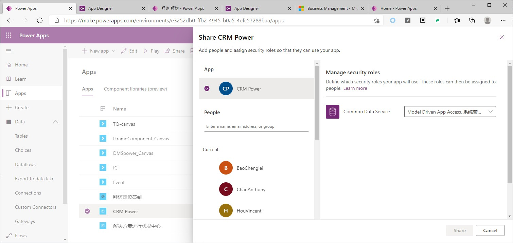

# 分享Apps
+ 刚创建的apps仅自己可见，要让其他人也能使用apps，必须分享。
+ 分享model-driven apps是，接收者必须有特定security role，具体是什么 security role，是由app creator指定的。

## 分享canvas app
+ 分享canvas apps，接收者可能不需要security role（security role仅在CDS中有用），但接收者需要有connector权限。
+ 比如这个canvas app要访问Google Drive，那么就要把Google Drive的账号密码告诉接收者(如果要访问同一个Google Drive账户的话)，接收者打开app时会提示需要登录Google Drive。
+ 如果canvas app只访问CDS，那么就需要security role了。
+ 

## 分享model-driven app
+ step1：点击share按钮
+ step2：选择App，右侧勾选哪些security role可以使用这个app。app creator知道此app使用了哪些entity，所以他应该知道哪些secrity role可以访问这个app
+ step3：选择接收人，右侧勾选一个security role，然后点share。如果接收人之前没有这个security role，会自动assign security role
+ 