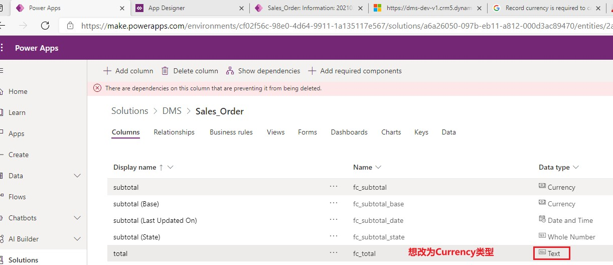
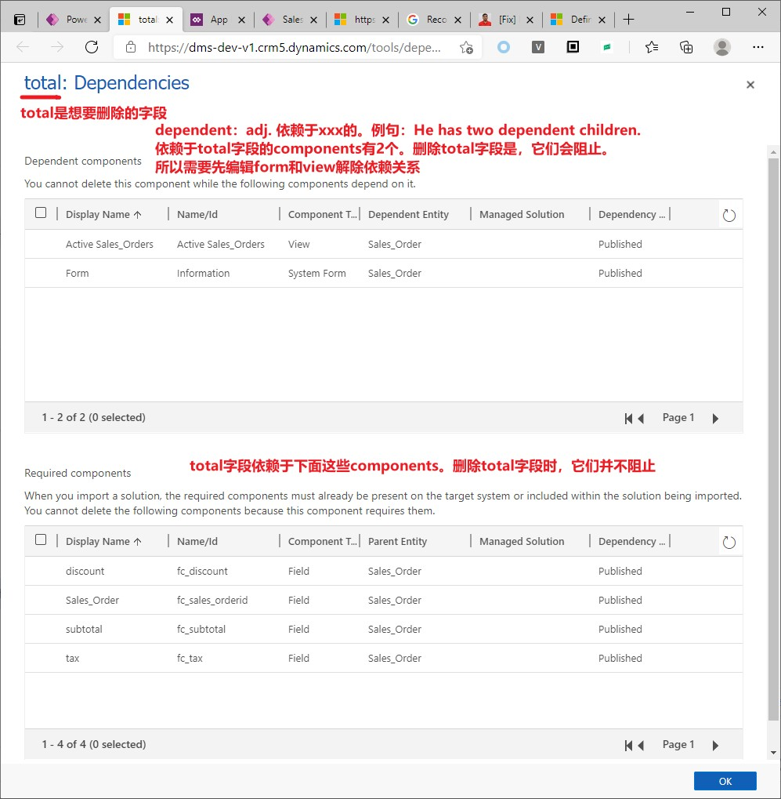

# 配置Dataverse的常见问题
+ 下面列出一下常见问题

## 无法删除
+ 当有依赖时，是无法删除的。比如我想修改一个字段的类型，但dataverse中不支持修改类型，只能删掉重新创建。但删掉时又提示有依赖。必须先解除依赖后才能删除。
+ total字段现在是Text类型，我想改为Currency类型。删除时报错：
+ 
+ 点击工具条中的`Show dependencies`，可以看到是 哪些组件 阻止了你执行删除操作。移除依赖后才可以删除。
+ 

