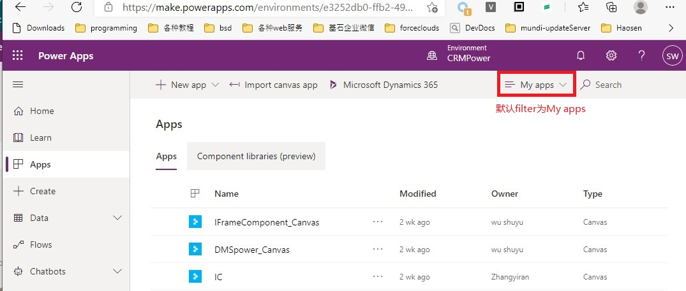
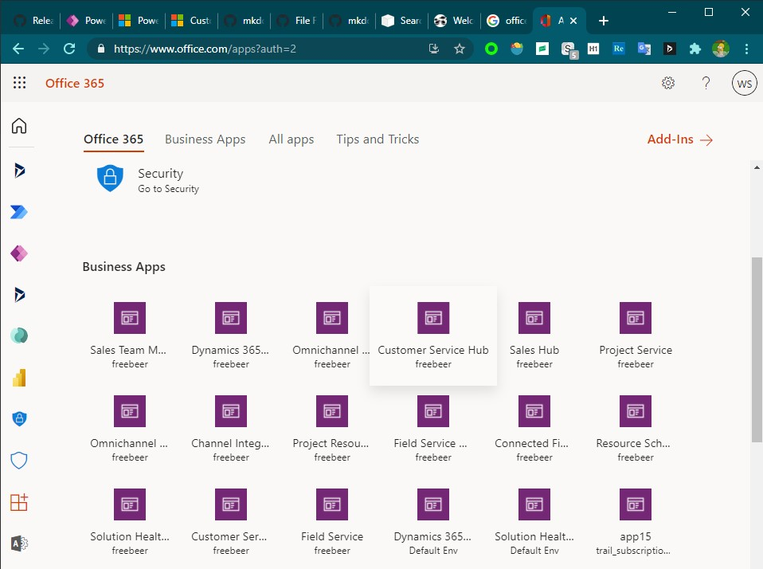
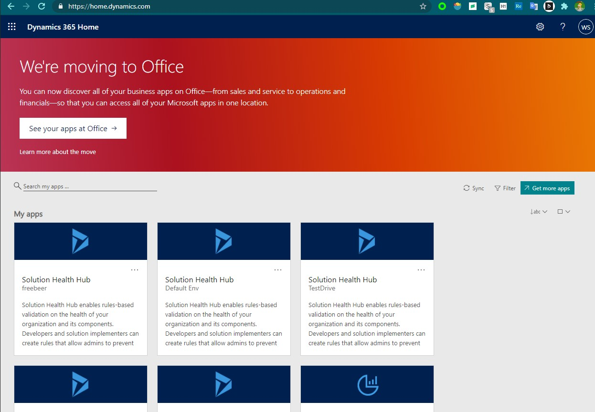
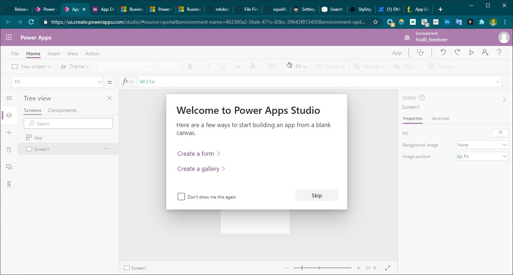

# 使用Power Apps Maker Portal
+ 先区分一下三个单词：
+ Power Apps，是微软的一个产品，app开发者主要操作 Power Apps Maker Portal。Power Apps Maker Portal是一个网页，地址是`https://make.powerapps.com/`，官方文档很多时候省略了`Maker Portal`。
+ Canvas App，Power Apps中的一种App，目的是在手机中使用（也可以在网页中使用），可以访问手机硬件（包括定位、相机）。
+ Model-Driven App，Power Apps中的一种App，目的是在PC浏览器中使用，不可以访问手机硬件。

## 查看apps
+ 点击左侧导航条中的Apps，右侧列出所有Apps，右上角可以修改filter和执行搜索。
+ 注意：**默认显示的是My apps，看不到别人分享给你的apps**，要看到别人分享给你的apps，需要切换filter为Org apps。
+ 

### 查看apps的另外两种方法
+ 除了在Power Apps Maker Portal中可以查看apps，还可以在另外两个地方查看apps。
+ 在`O365`中查看：
+ 
+ 在`home.dynamics.com`中查看：
+ 

## canvas app vs model-driven app
+ app有两种类型：canvas和model-driven
+ 分享对比：canvas分享时不需要配置security role，使用者用自己的权限（自己的账号连接connector）；model-driven需要配置security role。
+ 数据来源对比：canvas app的数据来自connector（多种来源）。model-driven app的数据只能来自CDS。
+ 导出对比：canvas app可以直接export为一个zip包，也可以重新import。model-driven app不支持export，只能加入到solution中，然后导出solution。
+ 版本管理对比：canvas app有版本管理，model-driven app没有版本管理。
+ 界面对比：canvas app的界面需要用`Power Apps Studio`开发，拖拽配置。model-driven app界面是固定的，只可以配置左侧导航条。
+ 运行环境对比：canvas app 针对手机端；model-driven app针对的是web端
+ Power Apps Studio截图：
+ 

## 切换环境
+ 一个tenant中有多个environment。environment是一个容器，其中包括一个dataverse instance、n个apps、n个automate flows。
+ 第一次进入Maker Portal，查看的都是`Default Env`，在顶部可以切换环境。管理员可以看到所有环境，员工能看到哪些环境是管理员配置的，员工肯定可以看见`Default Env`