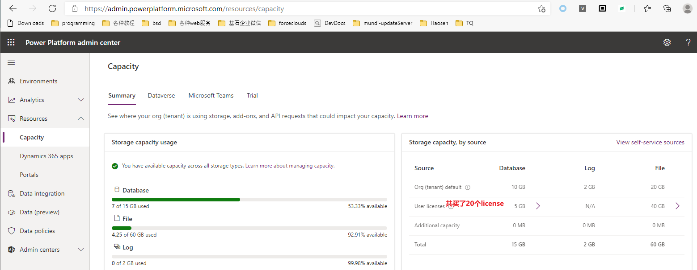
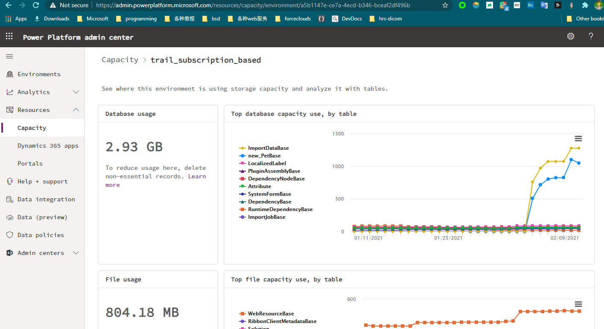
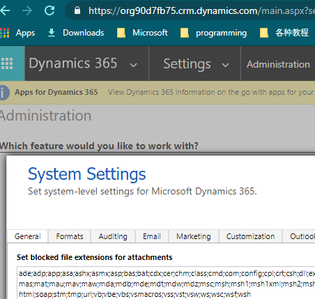

# PPac的功能
+ morden PPac中可以管理environment（包括新建、删除、备份、管理可访问用户、开关某个feature），查看capacity，设置Data policies。morden PPac很多功能会跳转到legacy PPac，比如添加user和添加security roles都会打开legacy PPac中的对应页面。
+ legacy PPac可以管理当前environment中的features、管理dataverse、管理users、分配security roles。

## 新建环境、环境的类型
+ 新建环境时需要选择环境的类型，有这些类型：`Production Sandbox Trial(Subscription-based) Trial`。除了这四种之外，还有三种类型：`Developer Default Support`，这三种都是系统创建的，无法手动创建。
+ `Trial`有效期是30天，所有成员都可以创建
+ `Trial(Subscription-based)`有效期也是30天，只有管理员可以创建
+ `Sandbox`和`Production`的区别主要是备份保存时长，可能性能上也有区别（未测试）。所有backups，包括system backups和manual backups，对于Production环境保留28天；对于sandbox环境保留7天。如果对production环境执行`switch to sandbox`，会立即丢弃21天的备份数据。

## 环境的备份
+ 文档见`https://docs.microsoft.com/en-us/power-platform/admin/backup-restore-environments`
+ 所有backups，包括system backups和manual backups，对于Production环境保留28天；对于sandbox环境保留7天。如果switch to sandbox，会立即丢弃21天的备份数据。
+ 备份是持续创建的，依赖于底层的 Azure SQL Database 
+ backup不提供下载功能，只支持restore到sandbox类型的环境。

## 查看capacity
+ [官方文档](https://docs.microsoft.com/en-us/power-platform/admin/capacity-storage)
+ 可以超出capacity，超出后所有的app都可以继续使用，超出后仅会限制一些操作，如：创建环境、复制环境、恢复环境。
+ 在PPac中可以看到 存储空间使用情况，还可以看到每日统计。
+ 表占用的空间，**包括了索引**
+ 仅Production和Sandbox环境计入账单额度。Trial Developer Support类型虽然占用空间，但不计入账单额度，显示的都是0GB，但可以看到内部的逐日统计。
+ 在Summary标签中，用了3个分组方式显示空间使用情况。左上角是按类型显示使用情况：共3种类型，File、Database、Log。右上角是按来源显示使用情况：开源分为3种：租户默认容量、user-license容量、额外购买的capacity。底部是按环境显示使用情况。
> 哪些数据算File类型？字段类型为File或Image，存储空间记作File。
> 文件保存在 Azure blob 中；full size image也保存在 Azure blob 在；thumbnail image and image metadata保存在dataverse中。
> 哪些数据算Log类型？这两个表算Log类型：AuditBase和PlugInTraceLogBase。
+ ===
+ Capacity-Summary截图：
+ 
+ Capacity-Summary-点击一个环境，显示环境存储空间逐日使用情况：
+ 

### 限制上传的文件size
+ **不支持限制上传的文件size**，我测试了上传一个2G大小的文件，是允许上传的。
+ 但支持限制file extension，方式如下：
+ 