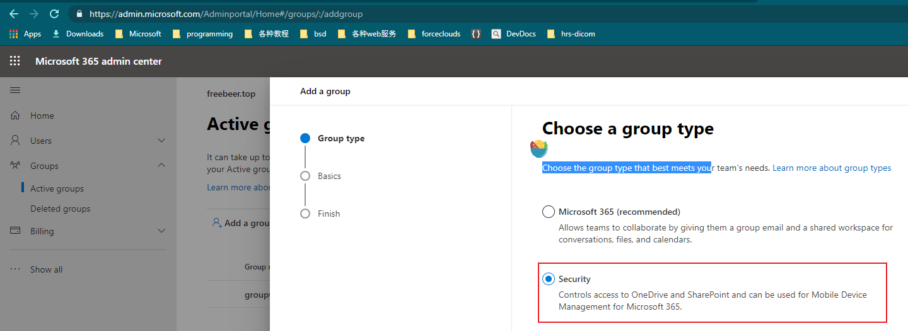
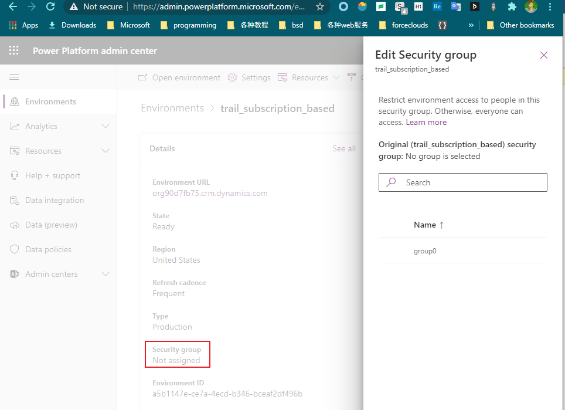

# 配置环境的security group
+ 用户管理，共2个级别。
+ environment级别，用**security group**，在Microsoft 365 admin center中配置。一个环境中只可以配置一个Environment Security Group。
+ CDS entity级别，用**security role**，在environment内部配置，一个环境有多个security roles。
+ 本节关注的是security group。
+ 只有管理员才可以配置**security group**，普通员工是没有这个权限的。
+ 1、管理员先在M365 admin center创建一个security group：
+ 
+ 2、在PPac中选择一个environment，修改Security group:
+ 
