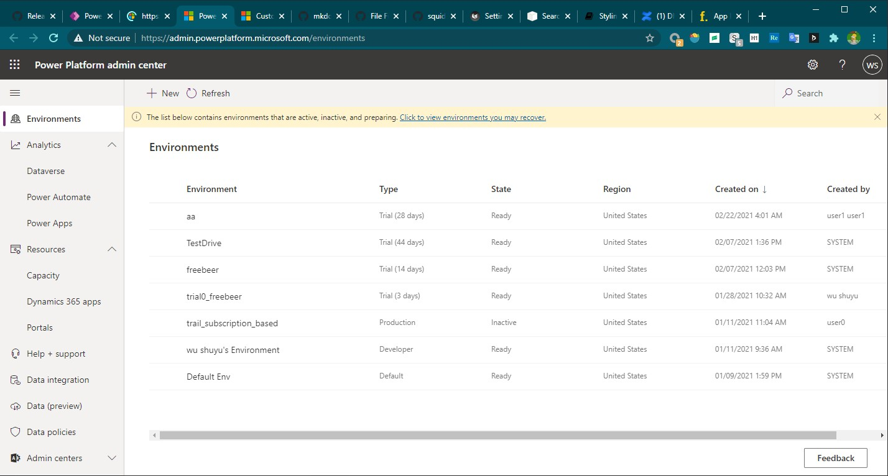
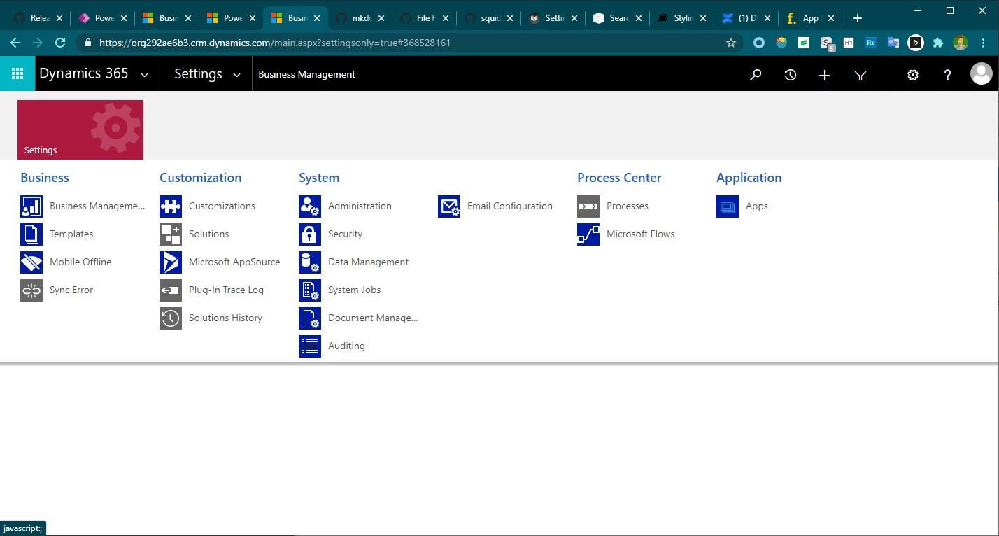

# 认识PPac
+ PPac这是我对Power Platform admin center的缩写。
+ PPac有两种：`morden interface`和`legacy interface`。
+ `morden PPac`网址为`https://admin.powerplatform.microsoft.com`。可以管理所有environment
+ `legacy PPac`需要通过点击`maker portal`右上角的`Advanced settings`进入，网址`https://XXX.crmN.dynamics.com/main.aspx?settingsonly=true`，只可以管理**当前这一个**environment。
+ `morden PPac`截图如下：
+ 
+ `legacy PPac`截图如下：
+ 

