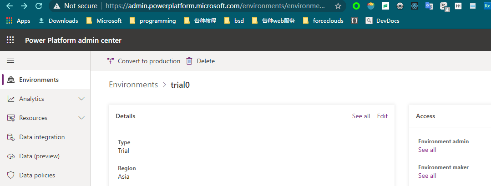
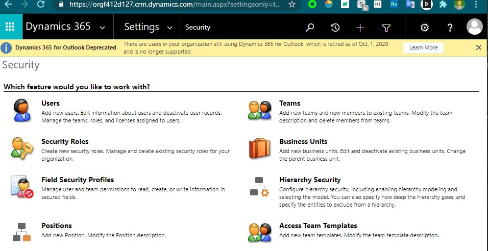
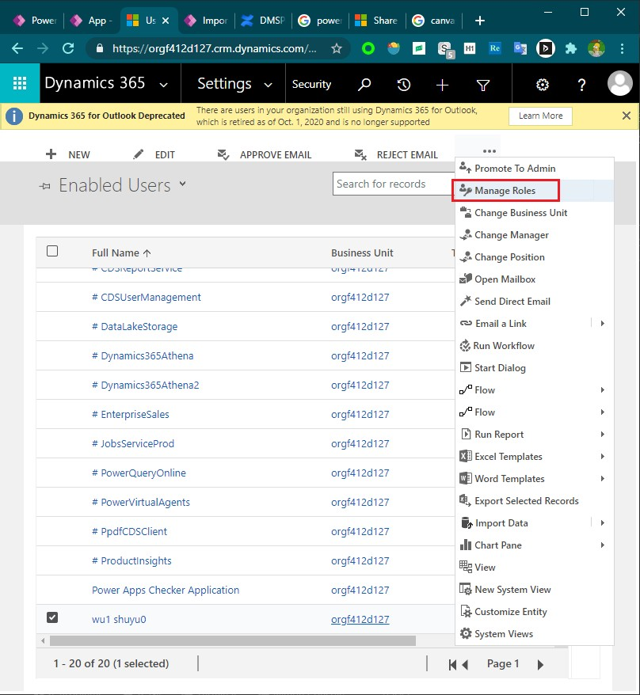

# security权限管理
+ CDS中使用的权限管理是 RBAC（Role-Based Access Control）方式。默认用户没有任何权限，必须明确分配一个security role后，用户才可以访问CDS中的数据。 
+ 可以访问environment，并不表示可以访问data！
+ environment创建后(未安装database前)，自带了两个roles：`System Administrator`和`Environment Maker`，截图如下：
+ 
+ 安装database后，会添加额外的几个role（截图如下），重要的只有这两个：`System Customizer`和`Common Data Service User`（`Common Data Service User`在文档中又叫做`Basic User`、`Dataverse User`）
+ 
+ security role是颗粒度最小的单位，一个user可以有多个security roles。

## 四个最重要的security roles
+ `System Administrator`有所有权限;
+ `Environment Maker`是默认角色、没有database权限、不可以管理其他用户，可以创建apps、可以添加新table
+ `Basic User`只可以创建记录，不可以定制
+ `System Customizer`可以定制，可以修改自己拥有的记录
+ 当一个user被添加到environment后，会自动添加2个roles：`Dataverse User`、`Environment Maker`

## 8种record-level privileges
+ privilege有两种：record-level的，和global-level的。如是否允许`Bulk Delete`，就是一个global-level privileges。本节只关注 `record-level privileges`
+ dataverse支持8种`record-level privileges`。分别是：Create、Read、Write、Delete、Append、Append To、Assign(将owner改为其他人)、Share。截图如下：
+ 
+ 每一个`record-level privilege`都可以设置不同的`access level`。`access level`共5种：None Selected、Users、Business Unit、Parent:Child Business Units、Organization
+ Append vs Append To。`Append`权限是允许**创建**一条child，`Append To`是允许**关联**一条child。示例：buyer表种有一个买家，姓名为`张三`，`user1`**创建**一条order记录（buyer为`张三`），需要的是`Buyer表的Append`权限；`user1`**修改**一条已有order**的buyer为`张三`，需要的是`Buyer表的Append To`权限

## Create Privilege 的作用
+ 它决定**创建**记录时是否允许修改owner
+ 如果`access level = None Selected`，则不可以创建记录
+ 如果`access level = Users`，则可以创建记录，如果没有team则不允许修改owner，如果有team则可以修改为team，（修改为team中的其他成员未测试）
+ 如果`access level = BU`，可以将owner改为 与自己相同BU的其他用户
+ 如果`access level = Parent:Child Business Units`，可以将owner改为 与自己相同BU的其他用户，或 比自己BU低的用户
+ 如果`access level = Organization`，可以将owner改为任意用户
> 官方文档中没有详细解释 Create Privilege 的作用，以上总结是我在论坛提问得到的答复，见`https://powerusers.microsoft.com/t5/Microsoft-Dataverse/A-Design-Flaw-in-Security-Role-Create-Privilege-should-only-has/m-p/819481#M9405`

## 分配security roles
+ 在 `morden PPac` 和 `legacy PPac` 中都可以分配 security roles。但`legacy PPac`中效率更高，这里以`legacy PPac`举例。
+ 在Settings-Security-Users,选中一个User，在顶部点击`Manage Roles`按钮
+ 
+ 
+ 

