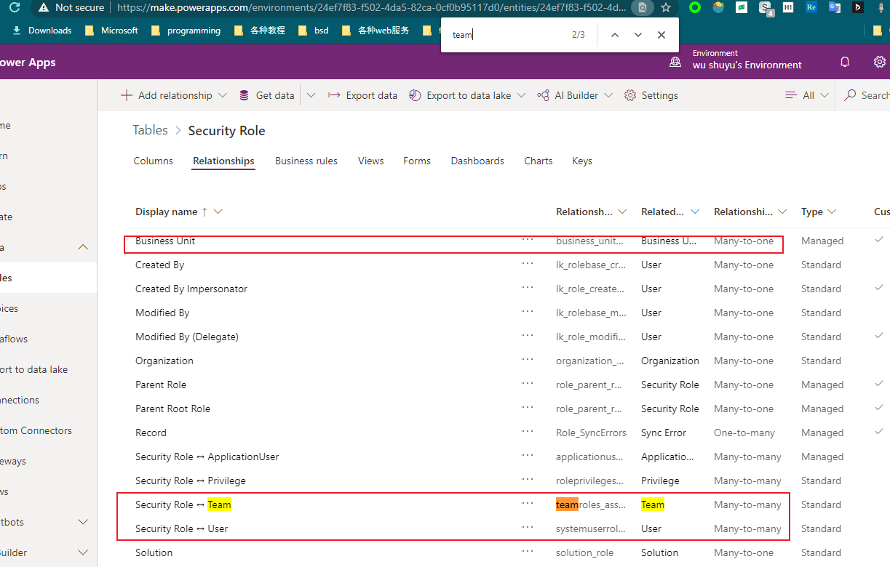
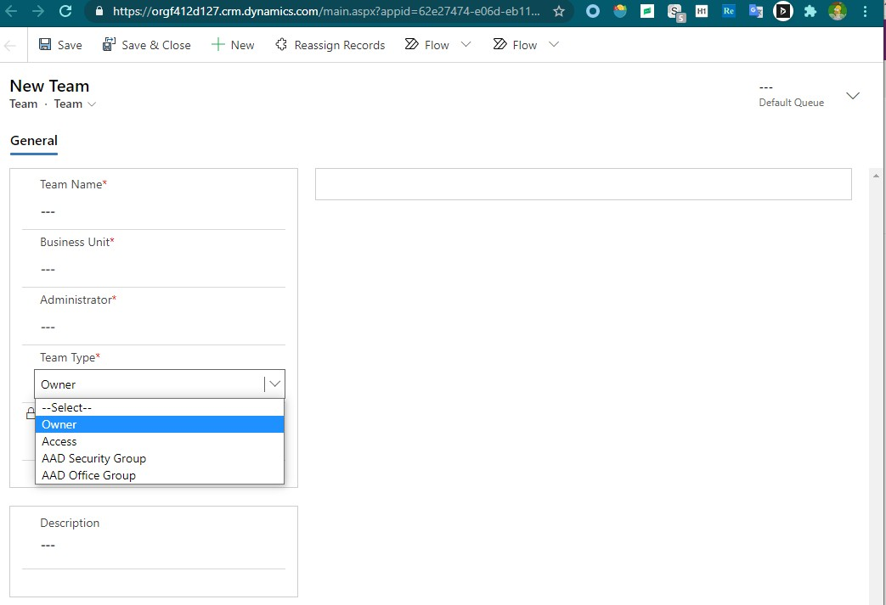

# 安全相关的entities
+ 跟安全相关的entities有这些:user、bu、team、position

# BU
+ BU是Business Unit的缩写。
+ 初始只有一个BU。BU有parent bu（`parentbusinessunitid`字段），可以组织为树形结构。正因为是树结构，security才可以向上查找。

# Position
+ 仅开启了`Hierarchy Security`后，Position才有用，默认没有开启

# team
+ team需要有一个administrator。
+ team只属于一个BU。user只属于一个BU。
+ team是为了跨BU合作（可以让team关联顶层BU）
+ user可以属于多个team。张三属于两个team，张三 创建的记录到底属于哪个team呢？这是由记录的owner决定的，张三创建的时候可以选择这个记录的owner到底是谁，可以是team之外的人、可以是自己、可以是teamX。
+ 一个user可以有多个Security Roles，一个security role可以有多个users，即M-M关系
+ 一个team可以有多个Security Roles，一个security role可以有多个teams，即M-M关系
+ 一个BU可以有多个Security Roles，一个security role只可以属于一个BU，BU-SecurityRole是1-M关系
+ security role 与 ”user/team/BU“的关系 截图：
+ 

## 创建team
+ team有4种，常用的有两种Owner Team和Access Team
+ owner team。需要给`owner team`分配`security roles`。owner为`team1`的记录，`team1`中的成员`user1`会自动获取访问权限。
+ access team。不需要给`access team`分配`security roles`。`access team`无法作为`owner`，记录的owner（或管理员）需要明确将记录分享给`access team`，`access team`中的成员以自己的权限对分享得到的记录进行操作。**可能存在这种情况：分享给了用户，但目标用户看不了**。
+ 创建`access team`是很容易的，但要使用`access team`比较麻烦，需要在entity级别开启、还需要创建`access team template`、还需要配置`main form`。用起来非常麻烦，我没有实验成功。
+ 
