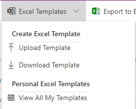
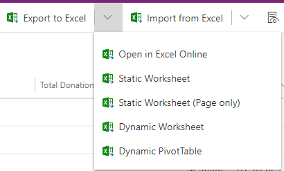
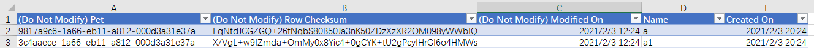

# 在 MD app 中导出excel数据
+ 导出数据有多种方式。
+  
+ `Excel Templates-Download Template`，下载模板时可以**手动选择columns**，前三列是隐藏列。可以本地修改后再上传上去，以后可以频繁复用，复用时就不用再次选择columns了。
+ `Export to Excel`（等于`Static Worksheet`），将文件下载到本地，前三列是隐藏列。下载**完整的**view数据，前三列是隐藏列。默认最多导出10万行，`select maxrecordsforexporttoexcel  from organization`可以看到这个阈值。用API可以增加此阈值。
+ `Open in Excel Online`，不下载到本地，直接在网页中编辑，可以看到**完整数据**，默认最多导出10万行，可以执行 新建、删除、编辑。保存后会自动导入，导入速度很慢，需要到importfile中查看进度。前三列是隐藏列
+ `Static Worksheet(Page only)`，将文件下载到本地，仅下载**当前page（50条）**，前三列是隐藏列
+ `Dynamic Worksheet`，dynamic的意思是每次下载时都要**让你勾选需要的列**，会将文件下载到本地，前三列是隐藏列
+ `Dynamic PivotTable`，dynamic的意思是每次下载时都要**让你勾选需要的列**，会下载一个excel文件，打开后**需要联网获取数据**。国内的网络环境会报错，最终显示一个空白文件

## 三个隐藏列的作用
+ 导出的excel前三列（ABC列）是隐藏列。保存的是guid、row checksum、modified_on
+ 
+ 在导入的时候，如果前三列是空白，则表示这行是新建的
+ 如果修改了某个字段的值，上传后Dataverse可以检测到checksum不一致，会认为这行是修改
