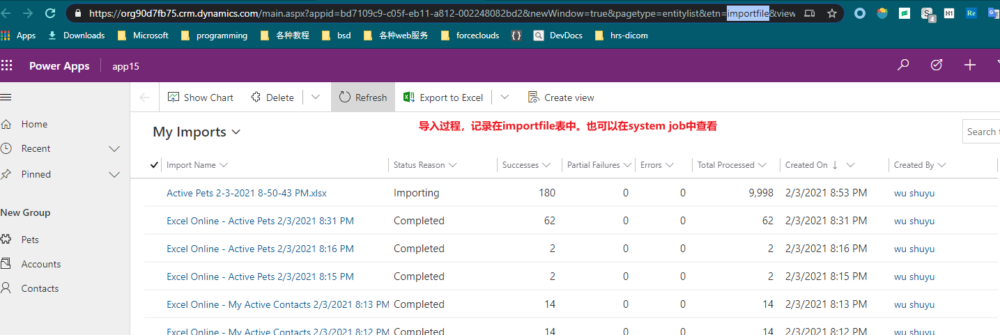
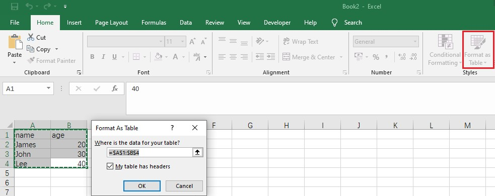
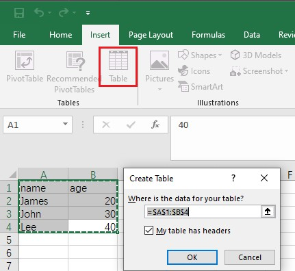
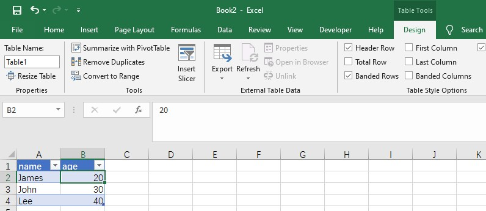

# 在 MD app 中导入excel数据
+ >注意必须用Microsoft Excel编辑文件，如果文件在WPS中编辑过就无法导入进Dataverse了！同理，如果在Google Docs中编辑过然后再下载到本地，这个xlsx文件就无法导入进Dataverse了。
+ 导入excel数据方法1：先从 MD app 中下载一个excel，添加新记录或修改已有记录。点击ribbon中的`Import from Excel`，上传此修改后的excel文件，会提示配置column mapping，直接选择默认值即可。点击确定后开始导入。
+ 导入excel数据方法2：点击`Open in Excel Online`，在网页中编辑，然后直接保存，保存时自动会执行导入操作。
+ **导入需要时间**，需要到importfile中监控导入进度。

## 追踪导入过程
+ 修改url，将`etn=xxx`改为`etn=importfile`，效果如图：
+ 

## 在excel中定义table
+ 一个 excel sheet 中可以定义多个 table。导入时excel时，数据必须位于table内。
+ 创建table有两种方法：
+ 创建table的第一种方法：Format As Table：
+ 
+ 创建table的第二种方法：Create Table：
+ 
+ 选中table中的一个cell时，ribbon中会增加一个`Table Tools Design`选项卡:
+ 
