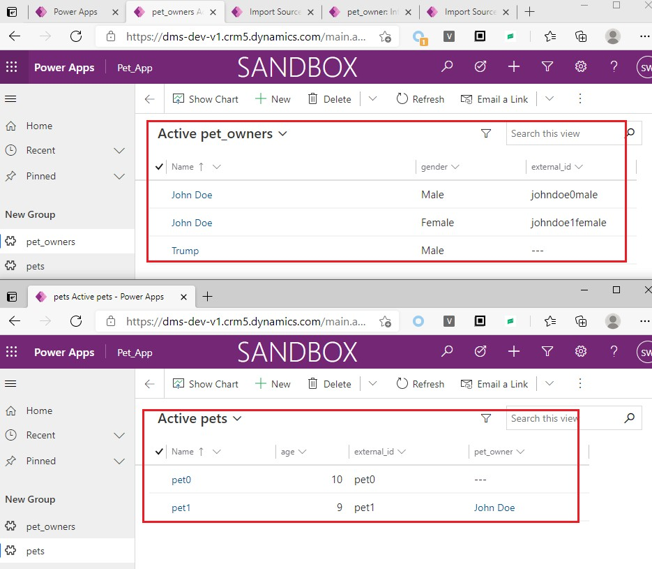

# 在 MD app 中导入excel数据
+ >注意必须用Microsoft Excel编辑文件，如果文件在WPS中编辑过就无法导入进Dataverse了！同理，如果在Google Docs中编辑过然后再下载到本地，这个xlsx文件就无法导入进Dataverse了。
+ 导入excel数据方法1：先从 MD app 中下载一个excel，添加新记录或修改已有记录。点击ribbon中的`Import from Excel`，上传此修改后的excel文件，会提示配置column mapping，直接选择默认值即可。点击确定后开始导入。
+ 导入excel数据方法2：点击`Open in Excel Online`，在网页中编辑，然后直接保存，保存时自动会执行导入操作。
+ **导入需要时间**，需要到importfile中监控导入进度。

## 追踪导入过程
+ 修改url，将`etn=xxx`改为`etn=importfile`，效果如图：
+ 

## 在excel中定义table
+ 一个 excel sheet 中可以定义多个 table。导入时excel时，数据必须位于table内。
+ 创建table有两种方法：
+ 创建table的第一种方法：Format As Table：
+ 
+ 创建table的第二种方法：Create Table：
+ 
+ 选中table中的一个cell时，ribbon中会增加一个`Table Tools Design`选项卡:
+ 

## 导入Lookup字段
+ 如果要导入的数据中存在Lookup字段，需要特殊处理。
+ Lookup字段中可以有两种值：primary attribute value、guid。
+ 下面用具体示例讲解：
+ 一个宠物美容中心使用Power Platform维护客户关系，创建了2个表：pet（宠物）、pet_owner（宠物主人）。一个宠物有一个主人，一个主人可以有多个宠物。初始状态截图：
+ 
+ 注意pet_owner表中有两个人是重名的。
+ 现在想导入3条数据，截图如下：
+ 
+ 导入后，1条成功，2条失败：
+ 
+ 详细的失败原因是A duplicate lookup reference was found，因为确实两个有重名的`John Doe`。截图如下：
+ 
+ 因为Trump没有重复，所以Trump的宠物petC导入成功了。
+ 为了导入petA和petB，需要获取GUID。下面是第二次导入的截图：
+ 
+ 导入之后可以看到5个pets：
+ 

### 获取GUID
+ 获取GUID有两种方式：
+ 方式一：从url中找，适合手动查找，如John Doe(Male)详情页url是 `https://dms-dev-v1.crm5.dynamics.com/main.aspx?appid=ab14c230-dc80-eb11-a812-000d3ac8b644&recordSetQueryKey=cr443_pet_owner-c049aa05-704e-4720-821f-e3297bc83361%253A%2520%253A%2520%253A%2520%253A%2520%253A%2520%253A%2520false%253A%2520%253A%2520%253A%252050&pagetype=entityrecord&etn=cr443_pet_owner&id=cbc7ed91-1282-eb11-b1ac-000d3aa39347`，可以找到id是`cbc7ed91-1282-eb11-b1ac-000d3aa39347` 
+ 方式二：通过alternate key和WebAPI获取，适合用程序抓取。需要先定义alternate key（定义alernate key时需要选择columns，此处只选择`external_id`），然后访问这个地址`https://dms-dev-v1.crm5.dynamics.com/api/data/v9.2/cr443_pet_owners(cr443_external_id='johndoe1female')` 。找到的id是`405d3151-dc80-eb11-a812-000d3ac8b644`
+ 