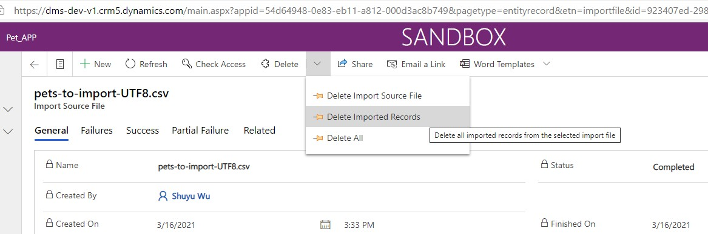

# 导入csv数据
+ 有时候创建excel比较麻烦。dataverse中可以导入csv。
+ 在maker portal中的导入csv时，不会创建importfile记录，无法追踪导入进度；在model-driven app中导入csv，会自动创建importfile记录，可以追踪导入进度，推荐在model-driven app执行导入。
+ 
+ 导入时候需要注意，编码必须是`UTF-8 BOM`，不能是`UTF-8`。`UTF-8`中的中文会乱码，`UTF-8 BOM`中的中文不会乱码。
> BOM是byte order mark的缩写。
+ 乱码的效果截图：
+ 
+ 如果出现乱码了，可以将本次导入的记录都删掉，见下图：
+ 

## 查看和修改文件encoding
+ 用`Notepad++`可以查看文件编码，见下图
+ 
+ `Notepad++`中还可以直接修改编码，用Encoding菜单，见上图。