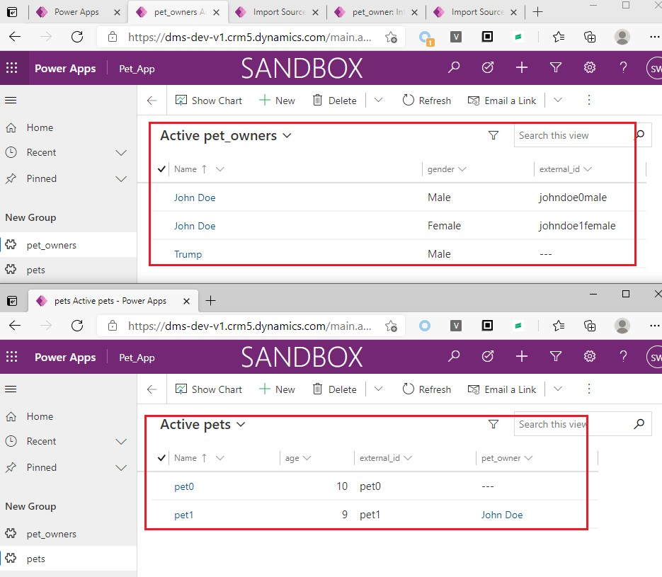
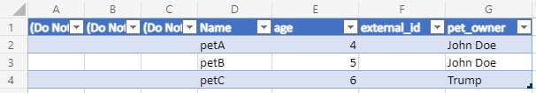
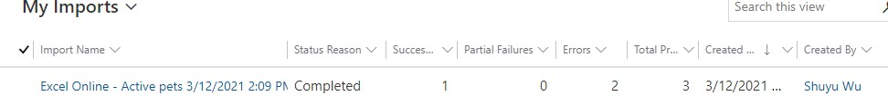
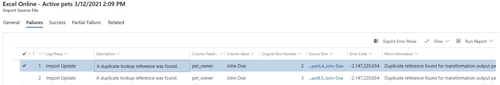
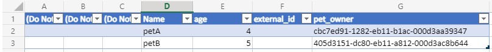
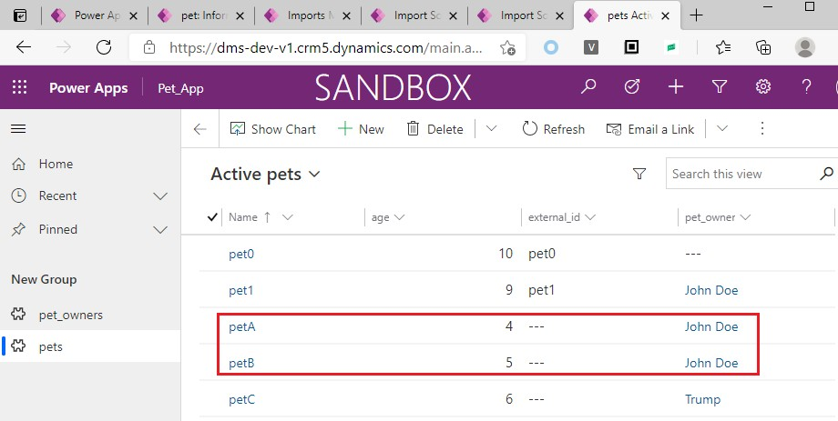
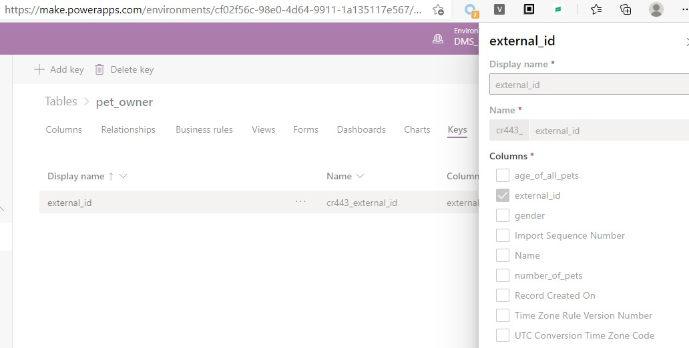
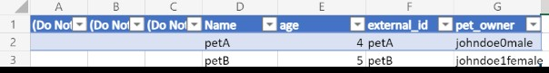
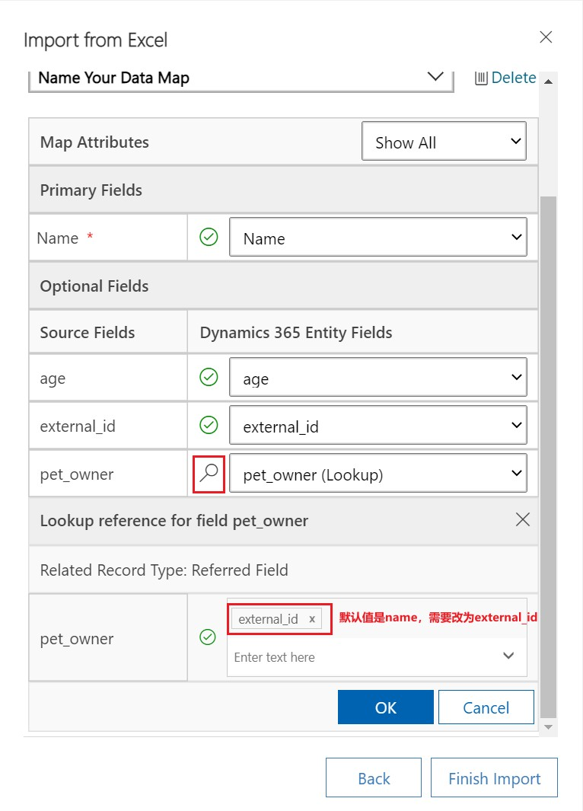
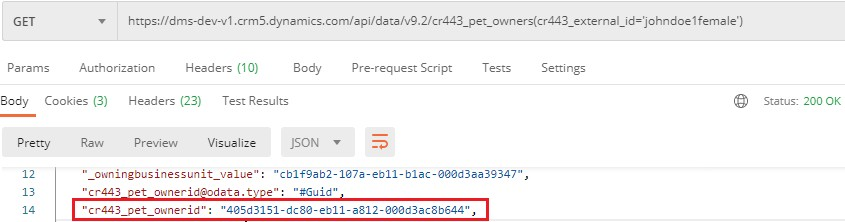

# 导入Lookup字段
+ 如果要导入的数据中存在Lookup字段，需要特殊处理。Dataverse会到现有的数据中查找，如果能找到唯一行，则可以导入成功，如果找到多行，则报错`A duplicate lookup reference was found`。
+ 参考文档`https://docs.microsoft.com/en-us/powerapps/user/import-data`
+ 下面用具体示例讲解：
+ 一个宠物美容中心使用Power Platform维护客户关系，创建了2个表：pet（宠物）、pet_owner（宠物主人）。一个宠物有一个主人，一个主人可以有多个宠物。初始状态截图：
+ 
+ 注意`pet_owner`表中有两个人是重名的，都叫 `John Doe`。
+ 现在想导入3条数据，截图如下：
+ 
+ 导入后，1条成功，2条失败：
+ 
+ 详细的失败原因是`A duplicate lookup reference was found`，因为确实两个有重名的`John Doe`。截图如下：
+ 
+ 因为Trump没有重复，所以Trump的宠物petC导入成功了。
+ 为了导入petA和petB，有两种方法：使用GUID、使用`alternate key`。

### 导入Lookup字段（用GUID）
+ 修改excel中的内容，`pet_owner`列 之前保存的是name，现在改为guid（查找guid的方式见下面的章节）。效果如图：
+ 
+ 导入之后可以看到5个pets：
+ 

### 导入Lookup字段（用alternate key）
+ 使用GUID导入比较麻烦，因为还需要去读取guid，给用户增加了负担。使用alternate key则更加简单，因为alternate key是自己定义的，避免了读取guid的过程。
+ 先创建一个alternate key，只选择一个column：`external_id`。效果如图：
+ 
+ 修改excel中的内容，`pet_owner`列 之前保存的是name，现在改为`external_id`，效果如图：
+ 
+ 导入的过程中有个`Review Mapping`按钮 ，点击此按钮 
+ 点击`Lookup Reference` button（放大镜图标），会打开`Lookup Reference` section，需要将`name`改为`external_id`。**这一步非常重要**！，效果如图：
+ 
+ 导入之后可以看到5个pets：
+ 

## 获取记录的GUID
+ 获取记录的GUID有两种方式：
+ 方式一：从url中找，适合手动查找，如John Doe(Male)详情页url是 `https://dms-dev-v1.crm5.dynamics.com/main.aspx?appid=ab14c230-dc80-eb11-a812-000d3ac8b644&recordSetQueryKey=cr443_pet_owner-c049aa05-704e-4720-821f-e3297bc83361%253A%2520%253A%2520%253A%2520%253A%2520%253A%2520%253A%2520false%253A%2520%253A%2520%253A%252050&pagetype=entityrecord&etn=cr443_pet_owner&id=cbc7ed91-1282-eb11-b1ac-000d3aa39347`，可以找到id是`cbc7ed91-1282-eb11-b1ac-000d3aa39347` 
+ 方式二：通过alternate key和WebAPI获取，适合用程序抓取。需要先定义alternate key（定义alernate key时需要选择columns，此处只选择`external_id`），然后访问这个地址`https://dms-dev-v1.crm5.dynamics.com/api/data/v9.2/cr443_pet_owners(cr443_external_id='johndoe1female')` 。找到的id是`405d3151-dc80-eb11-a812-000d3ac8b644`
+ 

