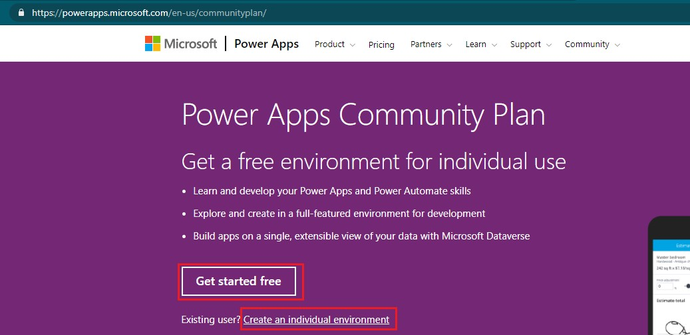

# 创建developer环境
+ developer环境是免费的，不会过期，但**只能自己访问**。在开发时，可以放心地在developer环境中乱搞，搞坏了还可以删除重建
+ 参考这个文档`https://docs.microsoft.com/en-us/powerapps/maker/dev-community-plan`
+ developer环境**不能在PPac创建**！必须在这个页面`https://powerapps.microsoft.com/communityplan`点击`Get started free`（如果没有账号），或点击`Create an individual environment`(如果已有账号)。
+ 