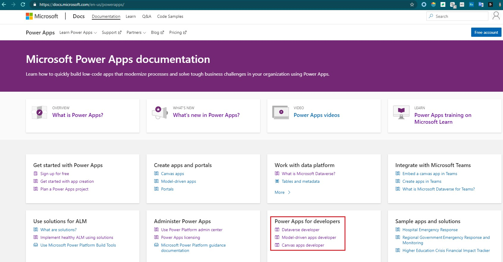
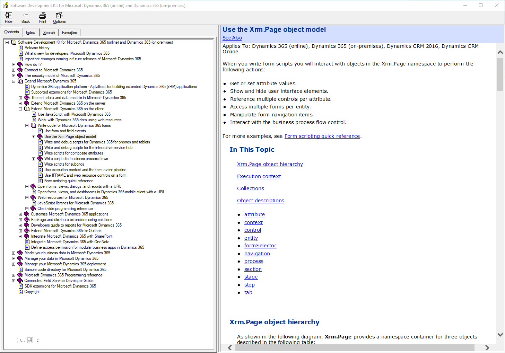

# Power Apps开发者文档
+ Power Apps开发者文档分为三种：Dataverse、Model-driven app、canvas app。`https://docs.microsoft.com/en-us/powerapps/`
+ 

## Dataverse 开发者文档
+ Dataverse 开发者文档 包括这些内容：Web API、Organization service、FetchXML、SQL、Webhooks、Plug-ins、Workflow extensions、OAuth、AAD application、Developer tools、Entity reference、SDK API

## Model-driven app 开发者文档
+ Model-driven app 开发者文档 包括这些内容：Client scriptiong、Client API、Web resources、code component、Customization XML reference
+ Client API，就是js中的`Xrm.Page`对象。可以用它来实现一些功能。

## Canvas app 开发者文档
+ Canvas app 开发者文档 包括这些内容：如何创建custom connector、如何创建component

## 2016年版SDK中的chm
+ 包含了 Dataverse开发资料 和 Model-driven app 开发资料。没有canvas app开发资料。
+ SDK下载方式见《下载SDK》章节
+ 