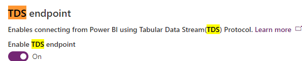
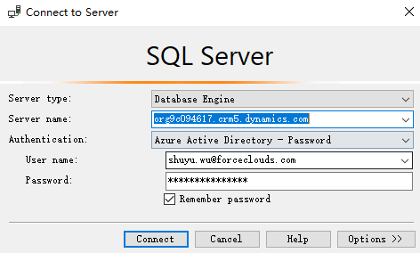
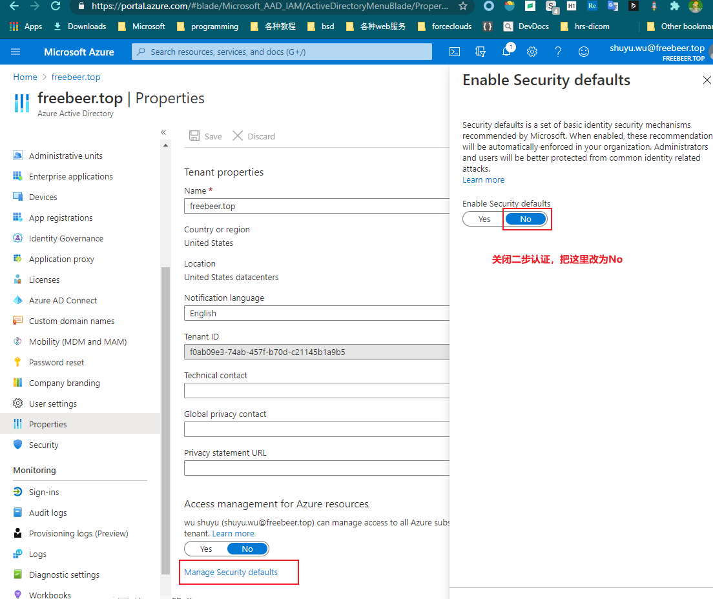

# 用SQL查询数据
+ Dataverse提供了SQL查询功能。提供的数据是readonly的，不支持通过SQL修改数据。
+ 默认这项功能是没有启用的，需要在`environment-features-TDS endpoint`启用。然后才能使用此功能。
+ 

## 用SSMS连接到Dataverse
+ SSMS是`Microsoft SQL Server Management Studio`，需要下载最新版本。用Navicat、Datagrip这些第三方工具，是无法连接到Dataverse的！只有SSMS才支持通过AAD认证。
+ 连接示例：
+ 
+ 如果打开了 multi-factor authentication 是等不不上的，会报错`AADSTS50076: Due to a configuration change made by your administrator, or because you moved to a new location, you must use multi-factor authentication to access '00000007-0000-0000-c000-000000000000'.`
+ 关闭 multi-factor authentication 的步骤(需要管理员权限)：
+ 