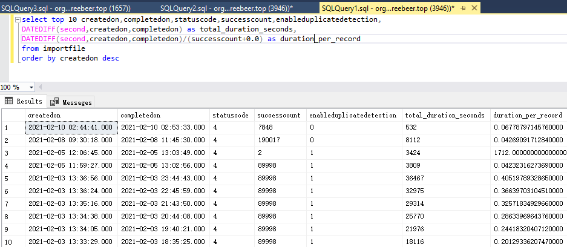

# 用SQL查询导入速度
+ 导入一个excel文件，会发现等很久才导入成功。在importfile详情中，可以看到开始时间，也可以看到结束日期，但是微软很鸡贼地隐藏了结束时间。导致用户无法获得完整的导入用时。
+ 现在微软提供了SQL接口，可以用SQL查询出导入用时，进而获得导入速度。SQL语句如下：
```
select top 10 createdon,completedon,statuscode,successcount,enableduplicatedetection,
DATEDIFF(second,createdon,completedon) as total_duration_seconds,
DATEDIFF(second,createdon,completedon)/(successcount+0.0) as duration_per_record 
from importfile
order by createdon desc
```
+ 注意这个SQL语句有一个缺陷，就是把parsing时间也算进去了，所以计算出来的`duration_per_record`并不准确。
+ 效果预览：
+ 
+ 从上图可以看到，导入速度大约是 20条/秒。也许Production环境速度可以更快一些
> 在我的笔记本电脑上，mysql插入速度是 1090条/秒。
+ 根据我的测试，允许Duplicate并不能加快导入
+ 

