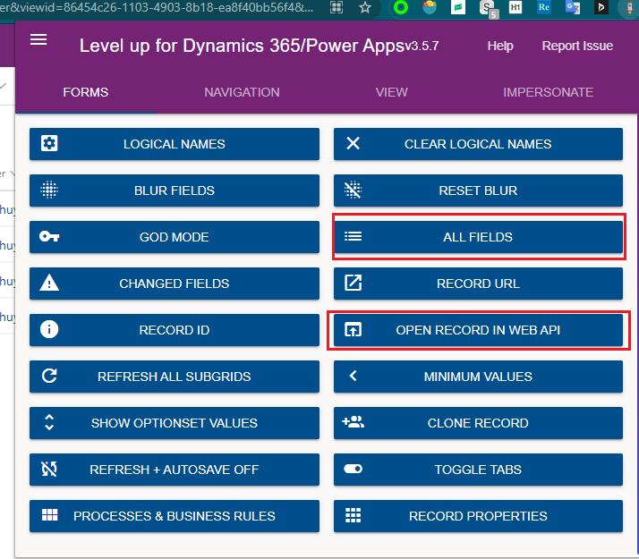
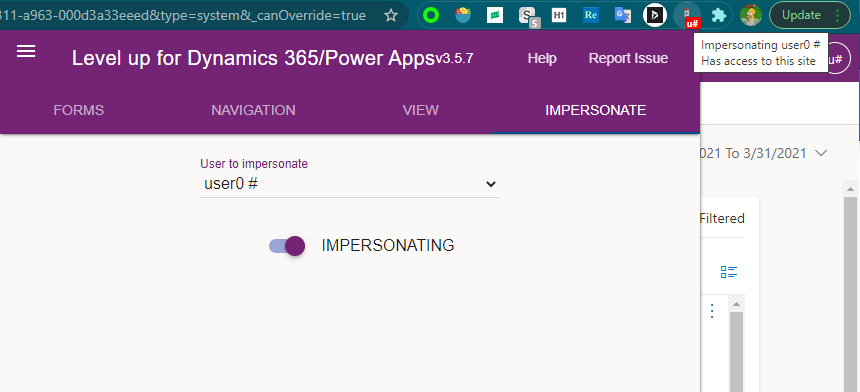

# Level up for Dynamics 365/Power Apps
+ 文档见`https://github.com/rajyraman/Levelup-for-Dynamics-CRM`
+ 它的功能很多，这里只介绍其中几个功能:
+ `All Fields`和`Open Record in Web API`，用这两个功能，可以看到所有字段。比如createdby、createdon一般是看不到的，用这两个功能可以看到。`All Fields`可以看到createdby的名字，但`Open Record in Web API`看不到createdby的名字，只能看到一个guid。
+ 前面说的importfile看不到导入完成时间，用这个功能也可以看到。
+ 
+ ===
+ impersonate功能，如果当前是管理员，可以登录其他人的账号。
+ 