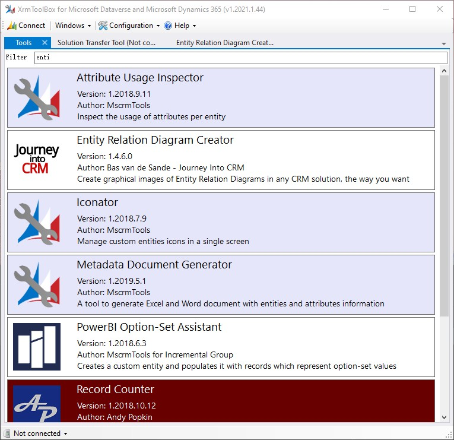
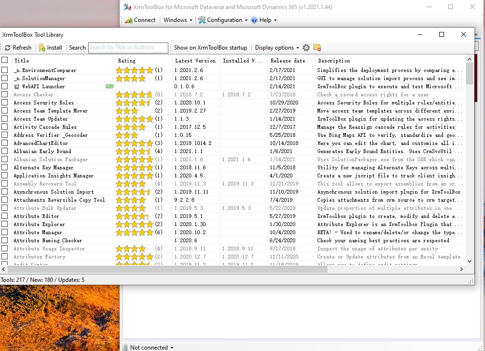

# 使用XrmToolbox
+ XrmToolbox内提供了很多工具，可以提高开发效率。这里只介绍其中几个工具：
+ `Metadata Document Generator`可以生成excel
+ `Ribbon Workbench`，用于配置Model-Driven app顶部的ribbon，如果不用这个工具，就需要手动编辑xml。
+ `Entity Relation Diagram Creator`，生成ER图，更容易理解多个元素之间的关系。如果需要写文档，可以使用此工具。
+ `Record Counter`，在canvas app和md app中都看不到 表的`总行数`，md app中最多显示5000条数据。可以用`select count(*) from table`查询，但经常不知道表名，而且SSMS用起来很卡。导出excel最多10万行，而且还需要下载很久。这时可以用这个工具获取 总行数。
+ 截图如下：
+ 

## 下载Tools
+ XrmToolbox内置了一些tools，还有很多tool是需要单独下载的。在Tool Library中下载，下载的文件会保存到`%appdata%\MscrmTools\XrmToolBox`。
+ Tool Library截图（共217个tools）：
+ 
