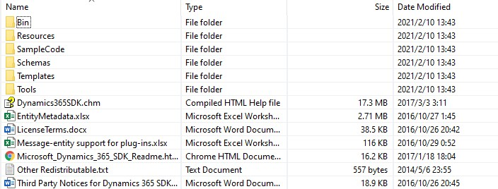
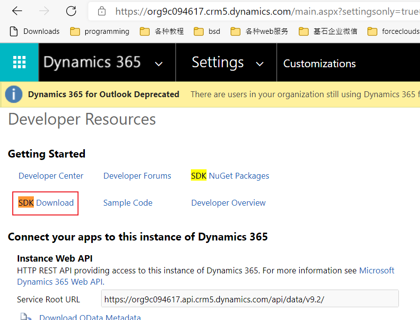

# 下载SDK包
+ 目前网上可以下载到两版SDK包，2015年版本、2016年版本。这两个版本中都包含 文档、示例代码、开发工具。
+ 最新的文档位于`https://docs.microsoft.com/en-us/powerapps/`
+ 最新的示例代码在 [microsoft/PowerApps-Samples](https://github.com/microsoft/PowerApps-Samples) ，示例代码的文档也在`https://docs.microsoft.com/en-us/powerapps/`
+ 开发工具托管在nuget上，开发工具的文档也在`https://docs.microsoft.com/en-us/powerapps/`
+ 直接下载一个SDK包，避免了到处找下载地址。而且SDK中提供的chm文档提供了很多开发相关的信息，可能比`docs.microsoft.com`上还全面。

## 下载2016年版本SDK
+ 下载地址 [Microsoft Dynamics 365 (v8.x) Software Development Kit (SDK)](https://www.microsoft.com/en-us/download/details.aspx?id=50032)
+ 解压后可以看到这些内容:
+ 

## 2015年版本SDK下载地址
+ 下载地址在这里：
+ 
+ 只下载2016年版本就行，这里的没必要下载

## SDK中比较重要的工具
+ EntityMetadata.xlsx 查看内置的metadata
+ Bin/SolutionPackager.exe 用于将解压和打包solution
+ Tools/PluginRegistration.exe plugin就是C#开发的dll，plugin只能通过这个工具上传到Dataverse
+ Tools/PackageDeployer.exe 用于上传sample data。solution中只包含customization，不包含数据。数据需要打包为package，用PackageDeployer上传
+ Tools/MetadataBrowser/MetadataBrowser_3_0_0_4_managed.zip 一个solution，用于查看metadata，避免了使用chrome plugin，功能比chrome extension少。(注意最新版是3.0.0.5，最新版可以单独下载)
+ 注意SDK中的版本都比较旧，可能无法登录成功（SDK中的PluginRegistration已经测试过了，无法登录成功）。最新版需要从nuget中下载。

