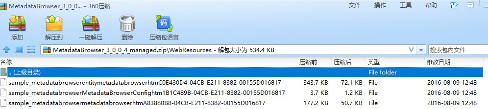
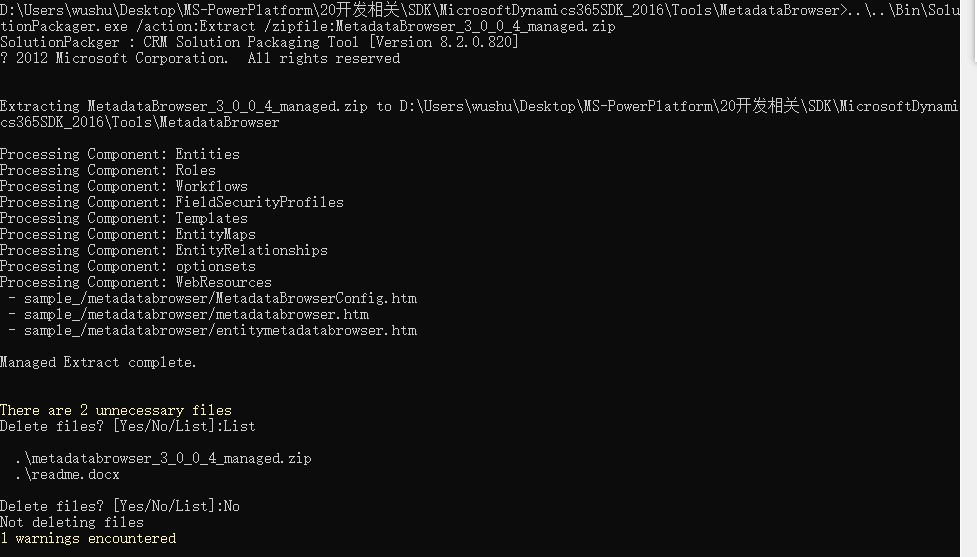
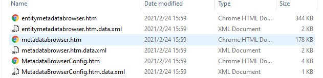

# 使用 SolutionPackager 抽取solution文件
+ 具体使用细节见微软文档，这里只是举个使用示例。
+ 导出solution是一个zip包，zip包内的文件是特殊的格式(没有后缀、没有很好的文件夹结构)，无法添加到 version control system。下面是`MetadataBrowser_3_0_0_4_managed.zip`的截图：
+ 
+ 执行`..\..\Bin\SolutionPackager.exe /action:Extract /zipfile:MetadataBrowser_3_0_0_4_managed.zip`会将文件解压到当前文件夹：
+ 
+ 抽出的文件是有后缀的，有良好的文件夹结构，可以添加到version control system，结构如图：
+ 
+ 抽出到一个新文件夹，需要指定`/folder:{folderName}`。示例：`SolutionPackager.exe /action:Extract /zipfile:<filename> /folder:extracted`
