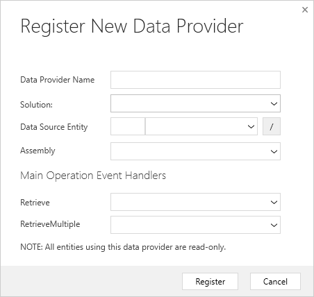

# 下载和使用PRT(Plugin Registration Tool)
+ 最新版本的PRT(Plugin Registration Tool)只能从nuget下载:
+ 
+ 
+ 下载后将`filename.version.nupkg`，改名为`filename.version.zip`，然后解压，解压后可以看到一个exe文件。
+ PRT界面：
+ 

## Register New Assembly
+ 

## Register New Step
+ 需要指定以哪个用户的权限执行，`Run in User's Context`。
+ Stage有3个：PreValidation PreOperation PostOperation。如果是Pre，则Execution Mode只能是Synchronous。如果Stage是Post，则Execution Mode可以选`sync or async`。
+ 

## Register New Data Provider
+ 

## Web Hook
+ web hook是external service暴露出来的，CDS中只是使用web hook。
+ web hook用于把更改事件通知到external system，并不影响CDS，比如每次 新建/修改/删除 contact，将记录发送给一个web endpoint。web hook不需要返回结果。
+ web hook创建后，需要新建Step，在`Step事件`是一个trigger，trigger触发后才会发送请求。
+ web hook可以是无验证的，也可以是有验证的，验证方式很简单，就是写死的header或query string。
+ web hook vs Azure Service Bus。webhook可以async也可以sync，但bus只能async；webhook不支持排队，bus支持queueing。都可以从plugin中触发。
+ sync execution的web hook，可以返回error，会显示到屏幕上。
+ [文档](https://docs.microsoft.com/en-us/powerapps/developer/data-platform/use-webhooks) Webhooks are relatively simple. The service will send the request and evaluate the response. The system **cannot parse any data** returned with the body of the response, it will **only look at the response StatusCode value**.
+ 

## Register New Image(这里Image不是图片，而是 假想状态)
+ 比如Update contact，我只知道修改后的credit（信用额度），公司要求一次最多增减五万，我想知道修改前的credit。
+ 在Plug-in中，我有两种方式获取current value：1、用organization service 2、用entity image。
+ 用`Pre Image`可以获得改动前的snapshot；用Post Image可以获得改动后的snapshot。这两个可以同时存在，会保存在`IExecutionContext.PreEntityImages IExecutionContext.PostEntityImages`
+ 这里image不是图片的意思，而是 假想的状态 。
+ 

## Register New Service Endpoint
+ 这个功能用于将Dataverse中的record 发送到 Azure Service Bus中。
+ 文档： [Expose Microsoft Dataverse data to Azure Service Bus](https://docs.microsoft.com/en-us/learn/modules/integrate-common-data-service-azure-solutions/2-azure-service-bus)
+ 