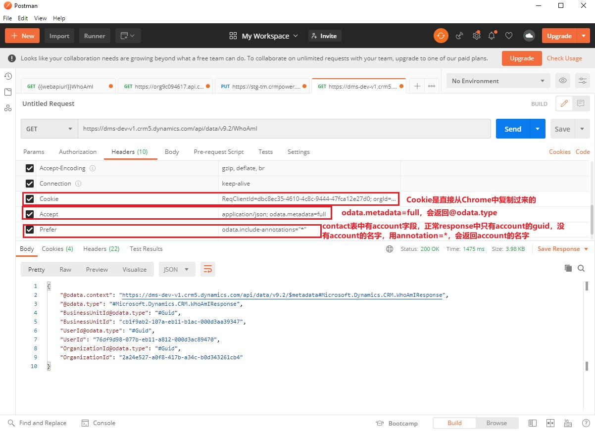

# 使用API
+ API有两种：Organization Service、Web API。
+ 这两种都是基于HTTP协议的，但Organization Service中数据是以SOAP（XML）格式呈现，Web API中数据是以JSON格式呈现的。
+ Organization Service 时间久，有微软封装好的C# library
+ Web API 可以用任何语言（python或java）调用，没有封装好的library

## 认证方式
+ 使用API都是需要认证的。认证有3种方式：cookie、oauth、S2S。S2S实际也是OAuth，是一种无需输入密码的OAuth认证方式。

|使用场景|认证方式|
|:---|:---|
作为Plug-in部署到Dataverse中(使用C# library开发)| 不需要认证，在调用Plug-in之前，Dataverse已经进行了用户认证了 
作为js部署到Dataverse中（js调用SOAP API或Web API） | 不需要认证，http request中有cookie，cookie中有认证信息。比如`Metadata Browser`就是这种方式
作为chrome插件运行（js调用SOAP API或Web API） | 不需要认证，chrome插件可以读取cookie，cookie中有认证信息。比如`Metadata Browser for Dynamics 365/Power Apps`就是这种方式
部署为SPA网页（js调用Web API） | 需要认证，OAuth 2.0协议。用户会跳转到microsoft，用户给application授权，授权后再跳转回原网页。需要先到AAD中注册一个application
手机端app（使用Web API）| 需要认证，OAuth 2.0协议。用户会跳转到microsoft，用户给application授权，授权后再跳转回app。需要先到AAD中注册一个application
部署为后端daemon（使用C# library开发）| daemon是随着系统启动的，daemon需要自动登录，不应手动输入账号密码。有两种认证方式：S2S（OAuth2.0，用的是application user）、在daemon内内置一个账号密码(使用non-interactive user账号，不需要license;也可以使用interactive user账号，占用一个license)。
部署为后端daemon（使用Web API）| 和上面相同
windows桌面应用（使用XRMTool library开发）| 只能通过OAuth认证，可以手动输入密码、也可以内置账号密码
Postman调用Web API | 有两种认证方式：Cookie、OAuth，用Cookie最简单
Python调用Web API | 有两种认证方式：Cookie、OAuth，用Cookie最简单

### 示例Postman调用Web API
+ 见截图：
+ 
