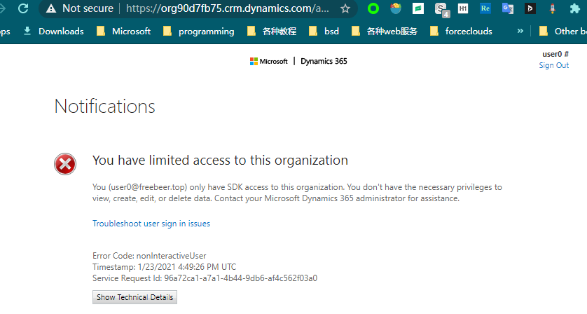
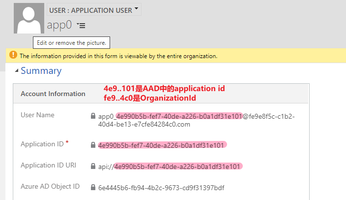

# 使用API
+ API有两种：Organization Service、Web API。
+ 这两种都是基于HTTP协议的，但Organization Service中数据是以SOAP（XML）格式呈现，Web API中数据是以JSON格式呈现的。
+ Organization Service 时间久，有微软封装好的C# library
+ Web API 可以用任何语言（python或java）调用，没有封装好的library

## 认证方式
+ 当你发现有些需求需要API才能实现时，需要，不同的使用场景，有不同的认证方式，见下表：

|使用场景|认证方式|
|:---|:---|
作为Plug-in部署到Dataverse中(使用C# library开发)| 不需要认证，在调用Plug-in之前，Dataverse已经进行了用户认证了 
作为js部署到Dataverse中（js调用SOAP API或Web API） | 不需要认证，http request中有cookie，cookie中有认证信息。比如`Metadata Browser`就是这种方式
作为chrome插件运行（js调用SOAP API或Web API） | 不需要认证，chrome插件可以读取cookie，cookie中有认证信息。比如`Metadata Browser for Dynamics 365/Power Apps`就是这种方式
部署为SPA网页（js调用Web API） | 需要认证，OAuth 2.0协议。用户会跳转到microsoft，用户给application授权，授权后再跳转回原网页。需要先到AAD中注册一个application
手机端app（使用Web API）| 需要认证，OAuth 2.0协议。用户会跳转到microsoft，用户给application授权，授权后再跳转回app。需要先到AAD中注册一个application
部署为后端daemon（使用Web API）| 仅支持S2S（OAuth2.0），不支持账号密码
部署为后端daemon（使用C# library开发）| daemon是随着系统启动的，daemon需要自动登录，不应手动输入账号密码。有两种方式：S2S（OAuth2.0）、在daemon内内置一个账号密码(使用non-interactive user账号，不需要license)。
windows桌面应用（使用C# library开发）| 有两种方式：OAuth2.0、账号密码登录

## 注册AAD Application
+ AAD：Azure Active Directory。
+ 什么使用场景需要注册AAD Application？当你需要使用Web API，且**部署到自己的服务器**时。一个AAD Application可以读取多个tenant中的数据。
+ 如果能部署为 Chrome extension，或部署到Dataverse中，是不需要认证的
+ ===
+ 下面讲解如何注册 `AAD Application`。注意仅管理员可以注册`AAD Application`，普通员工无此权限
+ 在Azure Portal，Azure AD，App Registration。创建`app0`(替换为你的application name)，可以获得`Application(client) ID`:4e990b5b-fef7-40de-a226-b0a1df31e101，效果如图：
+ 
+ 给`app0`添加`API permissions`，添加`Common Data Service`的 `impersonation` 权限。
+ 上面这些操作，只表示`app0`可以访问`CDS`，用户明确同意后，`app0`才可以impersonate（代客）操作。普通用户要使用`app0`，需要管理员批准。下图就是管理员未授权时的提示：
+ 

## SPA网页使用adsl.js执行OAuth认证
+ 参考官方文档，此处略过

## user类型（interactive、non-interactive、application）
+ interactive user 有账号密码、需要license。可以使用canvas app，可以使用md app，可以调用API
+ non-interactive user 有账号密码、不需要license。不可以使用canvas app，不可以使用md app，可以调用API
+ application user 没有密码（只有token）、不需要license。不可以使用canvas app，不可以使用md app，可以调用API
+ ===
+ 最多有7个non-interactive user，可以在详情页面中看到它的Access Mode：
+ 
+ non-interactive user 打开app会报错。无法在web端编辑record。报错截图：
+ 

## 创建 application user
+ 在User列表，切换**显示的view为Application User**，然后再点击New
+ 创建好的application user效果是这样的：
+ 
+ 如果遇到困难，参考我发问题贴子`https://powerusers.microsoft.com/t5/Microsoft-Dataverse/Unable-to-create-application-user/m-p/803613`

## S2S认证方式
+ S2S认证: Server to Server authentication
+ 部署为后端daemon（使用Web API）时才需要S2S。部署为后端daemon（使用C# library开发），可以用 non-interactive user，更加简单。
+ S2S认证实际就是自动登录为 application user。需要先为application user生成 client secret。实际上OAuth登录后也会生成secret，但有效期比较短，这里的client secret有效期时300年：
+ 

