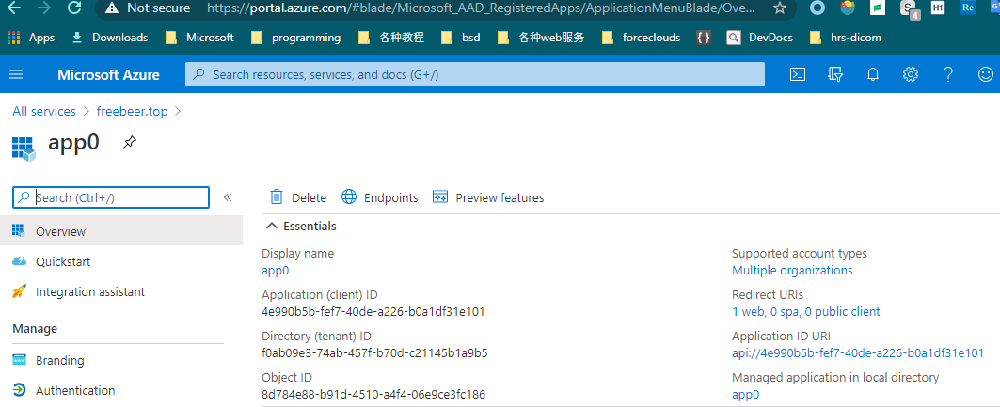
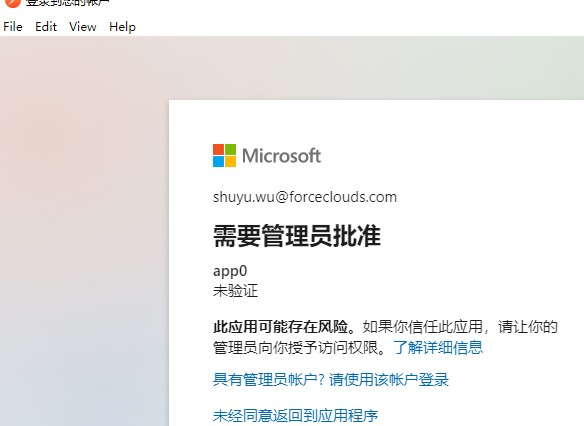

# 配置OAuth认证
+ 要使用OAuth认证必须先AAD Application，注册后可以获得`Application(client) ID`
+ 对于简单的程序，可以不自己注册AAD Application，而是使用微软提供的AAD Application。`ClientId="51f81489-12ee-4a9e-aaae-a2591f45987d"`，这个id是微软samples中使用到的id。见`https://github.com/microsoft/PowerApps-Samples/search?q=51f81489`

## 注册AAD Application
+ AAD：Azure Active Directory。
+ 什么使用场景需要注册AAD Application？当你需要使用Web API，且**部署到自己的服务器**时。一个AAD Application可以读取多个tenant中的数据。
+ 如果能部署为 Chrome extension，或部署到Dataverse中，是不需要认证的
+ ===
+ 下面讲解如何注册 `AAD Application`。注意仅管理员可以注册`AAD Application`，普通员工无此权限
+ 在`Azure Portal > Azure AD > App Registration`。创建`app0`(替换为你的application name)，可以获得`Application(client) ID:4e990b5b-fef7-40de-a226-b0a1df31e101`，效果如图：
+ 
+ 给`app0`添加`API permissions`，添加`Common Data Service`的 `impersonation` 权限。
+ 上面这些操作，只表示`app0`可以访问`CDS`，用户明确同意后，`app0`才可以impersonate（代客）操作。普通用户要使用`app0`，需要管理员批准。下图就是管理员未授权时的提示：
+ 

## SPA网页使用adsl.js执行OAuth认证
+ 参考官方文档，此处略过

## S2S认证方式
+ S2S认证: Server to Server authentication
+ 部署为后端daemon（使用Web API）时才需要S2S。部署为后端daemon（使用C# library开发），可以用 non-interactive user，更加简单。
+ S2S认证实际就是自动登录为 application user。需要先为application user生成 client secret。实际上OAuth登录后也会生成secret，但有效期比较短，这里的client secret有效期时300年：
+ 

