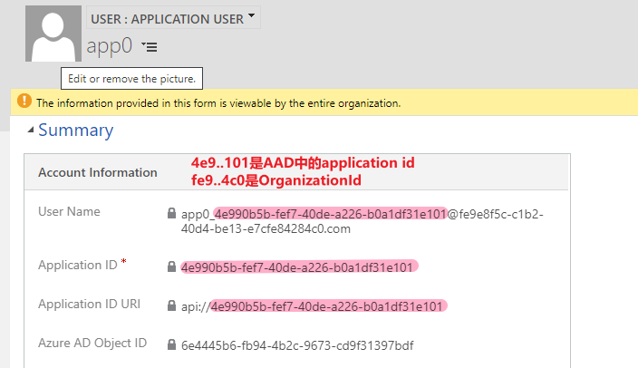
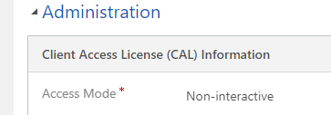
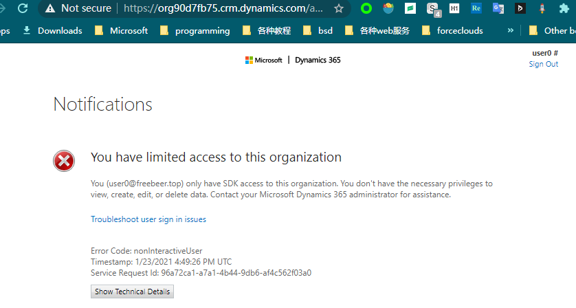

# 创建 application user
+ 在User列表，切换**显示的view为Application User**，然后再点击New
+ 创建好的application user效果是这样的：
+ 
+ 如果遇到困难，参考我发问题贴子`https://powerusers.microsoft.com/t5/Microsoft-Dataverse/Unable-to-create-application-user/m-p/803613`

## user类型（interactive、non-interactive、application）
+ interactive user 有账号密码、需要license。可以使用canvas app，可以使用md app，可以调用API
+ non-interactive user 有账号密码、不需要license。不可以使用canvas app，不可以使用md app，可以调用API
+ application user 没有密码（只有token）、不需要license。不可以使用canvas app，不可以使用md app，可以调用API
+ ===
+ 最多有7个non-interactive user，可以在详情页面中看到它的Access Mode：
+ 
+ non-interactive user 打开app会报错。无法在web端编辑record。报错截图：
+ 

