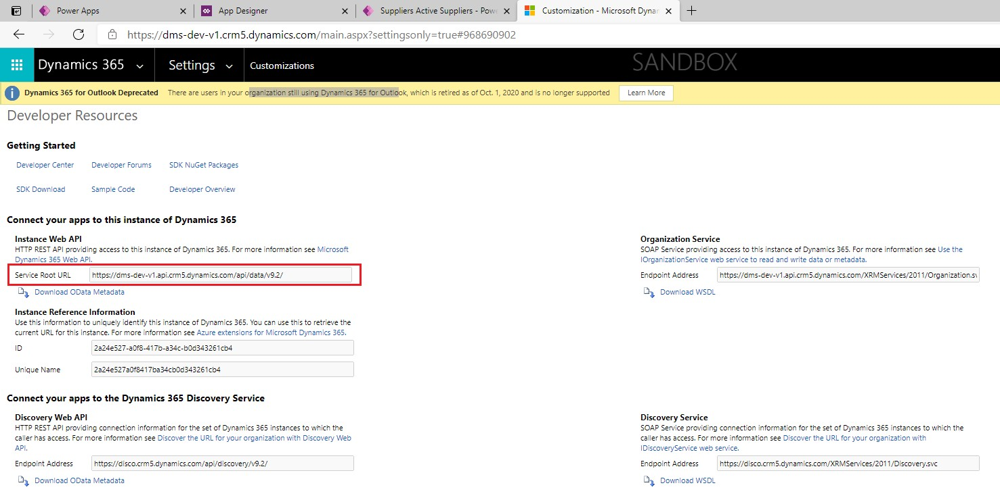

# WebAPI示例
+ WebAPI实现了OData规范，参数传递规则不是传统的`?param=value`形式，而是OData中规定的形式。

# 查找service root url 
+ 要使用WebAPI，需要知道service root url。可以从这个地方看到
+ 

## 查询数据
+ 查看支持哪些entity：`{service_root_url}/`，返回的是json。返回的结果叫做service document
+ 查看entity中有哪些key、查看支持哪些Function：`{service_root_url}/$metadata`，返回的是xml。返回的结果叫做metadata document
+ WhoAmI是一个Function，url中区分大小写！`{service_root_url}/WhoAmI`。返回的是WhoAmIResponse类型，在metadata中可以看到具体有哪些字段。
```
<Function Name="WhoAmI">
    <ReturnType Type="mscrm.WhoAmIResponse" Nullable="false"/>
</Function>
```
+ 查看EntitySet，EntitySet是一个collection，其中有多条记录，可能会分页。示例:`{service_root_url}/accounts`
+ 查看EntityType中的一条记录，需要传入id。示例`{service_root_url}/accounts(2B4B2517-237A-EB11-B1AB-000D3A07B28A)`。可以明确指定key name`{service_root_url}/accounts(accountid=2B4B2517-237A-EB11-B1AB-000D3A07B28A)`。key在metadata中可以看到。
```
<EntityType Name="account" BaseType="mscrm.crmbaseentity">
    <Key>
    <PropertyRef Name="accountid"/>
    </Key>
...
```
+ 使用alternate key查询一条记录。示例，我用3个字段定义了一个alternate key，用这种方式查询，注意整数类型不能带单引号！`{service_root_url}/fc_regions(cr443_code='1',fc_name='北京市',fc_administrativelevel=948150005)`
+ 可以看到，url格式很像C语言中的函数调用。

## 使用query options
+ query options放到url query中，如`?$filter=Name eq 'Milk'`
+ query options有3种： system query options, custom query options, and parameter aliases。
+ system query options有这些：`$search $filter $count $orderby $skip $top $expand $select $format`
+ OData-defined system query options are prefixed with "$".
+ custom query options必须以`$ or @`开头
+ parameter aliases用于复用参数

### system query options示例
+ 仅显示需要的一个字段 `{service_root_url}/accounts(2B4B2517-237A-EB11-B1AB-000D3A07B28A)?$select=name`
+ 仅显示需要的多个字段（用逗号分隔） `{service_root_url}/accounts(2B4B2517-237A-EB11-B1AB-000D3A07B28A)?$select=name,address1_line1`
+ `?$top=3&$skip=10`，查看第二页的三条数据。
+ `?$count=true` 获取`odata.count`。如果是`/$count`，则仅返回一个整数，没有大括号。
+ `?$expand=ownerid` 将ownerid进行in line处理。一个请求直接获得两个records，方便！`$expand`只能应用到navigation property，如果是`single-valued navigation property`则返回`{}或null`，如果是`collection-valued navigation property`，则返回`[]`。`expand`还支持级联展开`?$expand=fc_Parent($expand=ownerid)`。什么是navigation property，见下面的描述。

### parameter aliases query optiosn 示例
+ CalculateRollupField是一个Function，可以手动触发，示例：
```
{service_root_url}/CalculateRollupField(FieldName='cr443_age_of_all_pets',Target=@target)?@target={'@odata.id':'cr443_pet_owners(405D3151-DC80-EB11-A812-000D3AC8B644)'}
```
+ 示例2：`http://host/service.svc/Employees?$filter=Region eq @p1&@p1='WA'`


# Navigation properties
+ 比如从order.buyerid可以找到buyer，buyerid就是`navigation property`。
+ single-valued navigation property，就是Lookup属性
+ Collection-valued navigation property，从buyer这边可以找到多个order。
+ single和collection互相为partner。
+ 见下面的注释：
```
<EntityType Name="account" BaseType="mscrm.crmbaseentity">
    <!--createdby就是single-valued navigation property，因为Type是mscrm.systemuser-->
    <NavigationProperty Name="createdby" Type="mscrm.systemuser" Nullable="false" Partner="lk_accountbase_createdby">
    <ReferentialConstraint Property="_createdby_value" ReferencedProperty="systemuserid"/>
    </NavigationProperty>
</EntityType>
<EntityType Name="systemuser" BaseType="mscrm.principal">
    <!--lk_accountbase_createdby是Collection-valued navigation property，因为Type是Collection(mscrm.account)-->
    <NavigationProperty Name="lk_accountbase_createdby" Type="Collection(mscrm.account)" Partner="createdby"/>
</EntityType>
```