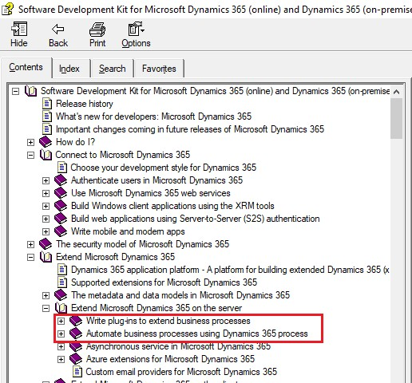
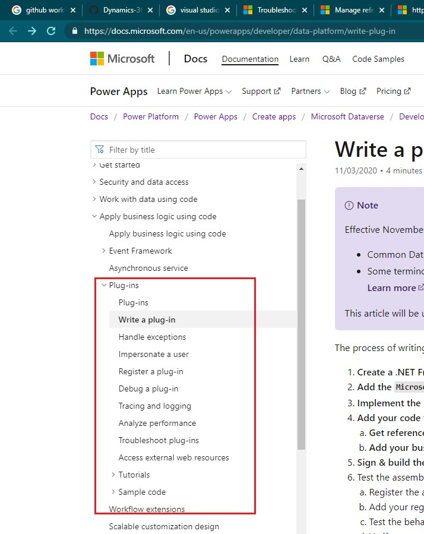

# 用C#扩展后端功能
+ 什么场景需要用C#扩展后端功能？
+ 比如订单发货后需要自动扣减库存，用现有的功能无法实现，用Power Automate也无法实现（因为Power Automate只能读取现值、无法获得改动前的值），这时就必须用C#写后端逻辑了。
+ 用C#扩展后端逻辑有两种方式：plugin 和 custom workflow activity。这两种方式都要编译为dll，用PluginRegistrationTool上传到dataverse中的。
+ 这两种方式的区别：One difference between the two is that for custom workflow activity assemblies, you register just the assembly. For plug-ins, you register the plug-in assembly and one or more steps per plug-in.
+ workflow activity的好处是可以重新安排顺序
+ 如何使用PluginRegistrationTool，见 [使用PRT](../20下载和使用SDK/20使用PRT(Plugin%20Registration%20Tool).md)

## 官方文档
+ 2016版SDK中的Dynamics365SDK.chm
+ 
+ `https://docs.microsoft.com/en-us/powerapps/developer/data-platform/write-plug-in`
+ 

