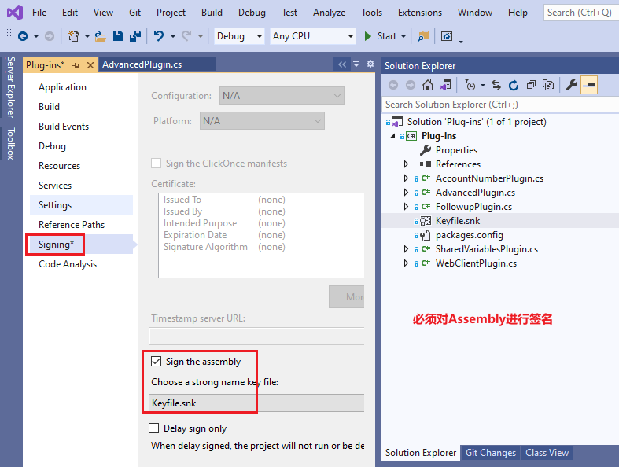

# 创建Plugin
+ 需要创建一个Visual Studio Project，plugin需要实现`Microsoft.Xrm.Sdk.IPlugin`接口
+ IPlugin中仅有一个Execute方法，从`IServiceProvider`中可以获取到 `plug-in execution context (IPluginExecutionContext), tracing service (ITracingService), organization service (IOrganizationServiceFactory), and notification service (IServiceEndpointNotificationService)`
```
namespace Microsoft.Xrm.Sdk
{
    public interface IPlugin
    {
        //
        // Summary:
        //     Executes plug-in code in response to an event.
        //
        // Parameters:
        //   serviceProvider:
        //     Type: IService_Provider. A container for service objects. Contains references
        //     to the plug-in execution context (Microsoft.Xrm.Sdk.IPluginExecutionContext),
        //     tracing service (Microsoft.Xrm.Sdk.ITracingService), organization service (Microsoft.Xrm.Sdk.IOrganizationServiceFactory),
        //     and notification service (Microsoft.Xrm.Sdk.IServiceEndpointNotificationService).
        void Execute(IServiceProvider serviceProvider);
    }
}

namespace System
{
    public interface IServiceProvider
    {
        //
        // Summary:
        //     Gets the service object of the specified type.
        //
        // Parameters:
        //   serviceType:
        //     An object that specifies the type of service object to get.
        //
        // Returns:
        //     A service object of type serviceType. -or- null if there is no service object
        //     of type serviceType.
        object GetService(Type serviceType);
    }
}
```
+ 插件可以修改`IPluginExecutionContext`中的值。
+ `IServiceEndpointNotificationService`只提供一个功能，将当前entity发送到azure service bus。需要先注册`Service Endpoint`
+ 使用`context.InputParameters`。它有哪些key呢？比如当前request message是`CreateRequest`，那么CreateRequest下的所有property都可以从`context.InputParameters`中读取（最重要的是`Entity`属性）。但类型需要手动cast，比如`DeleteRequest`的Entity的类型是`EntityReference`。可以Entity内部的数据。
+ 使用`context.OutputParameters`。它有哪些key呢？当前response message中的所有property都可以从`context.OutputParameters`中读取。
+ pre and post images。仅sync post-event和async plugins可以获得PostEntityImages。create消息没有pre-images，删除没有post-images。
+ 对于sync类型的plugin，可以抛出自定义异常，会显示在UI上。`InvalidPluginExecutionException`，修改它的Message字段。
+ 对于async类型的plugin，每次执行都创建一个system job。
+ plugin间可以传递数据，只需把kvpair保存在`context.SharedVariables`中即可。
+ 扮演其他用户（impersonate）。在register step时，可以指定以哪个用户执行；运行时也可以修改。在`IPluginExecutionContext`中有InitiatingUserId，它是当前请求的触发者，而`UserId`是要扮演某个人。比如张三创建了记录，但plugin以admin权限执行，InitiatingUserId是张三，UserId是admin。
+ 推荐将plugin注册到database中，注册到database中会自动在多个server间分发。on-disk方便调试。Power Platform，仅支持保存到database中。

## PluginClass的constructor
+ PluginClass可以有constructor
```
public SamplePlugin()
public SamplePlugin(string unsecure)
public SamplePlugin(string unsecure, string secure) //这两个参数，是在Register New Step中配置的。
```
+ 


## plugin的运行环境
+ plugin和workflow activity默认都是在`sandbox`中执行的，可以访问organization service，但不可以访问filesystem、不可以访问registry、有受限的network功能。
+ D365会监控plugin执行，如果超过了CPU阈值，或memory阈值，会自动被kill掉。被kill的不是一个request，而是一个进程（可能有多个requests）

## 签名
+ 必须对plugin assembly进行签名。可以用VS中的Signing，或sn.exe（Strong Name tool）
+ 

## 示例代码
+ 见`https://github.com/microsoft/PowerApps-Samples/tree/master/cds/orgsvc/C%23/FollowupPlugin`


## 配置plugin
+ 如何使用PluginRegistrationTool见单独的章节。
+ plugin的所有配置都是通过 PluginRegistrationTool，可以register、unregister、update、disable、enable