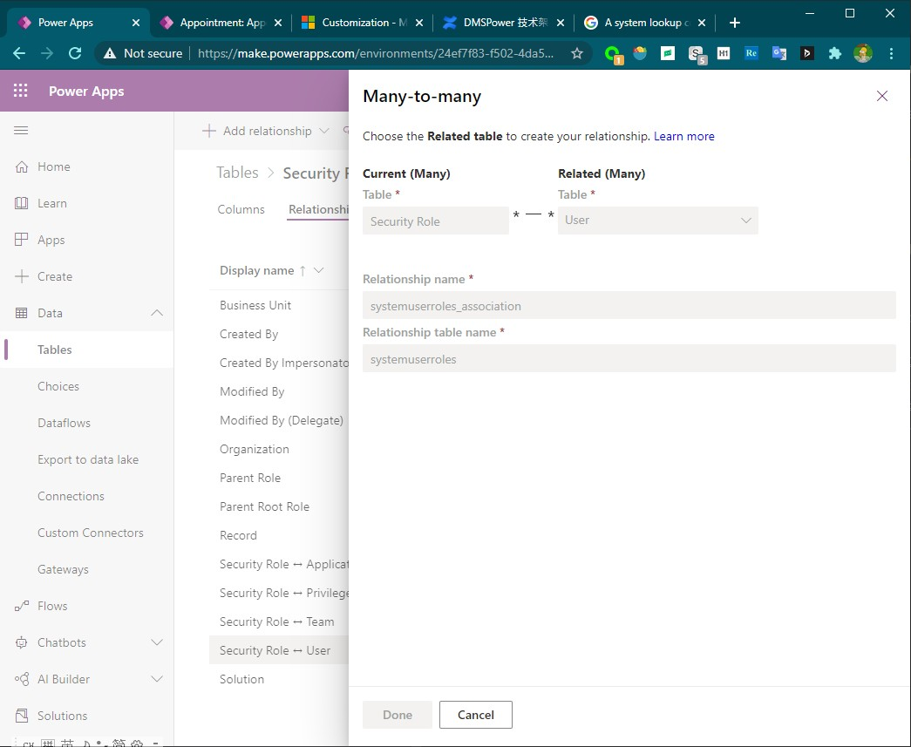

# 关系型数据库中的各种概念
+ schema，n.结构。在db中，schema的作用是一个容器，schema中可以有n个table、n个views、n个stored procedures
+ table，一个二维表，有多个字段，每一行是一条记录
+ entity，英文中表示一个”独立存在物“。在数据库领域，就是table的意思
+ field、column，table中的一个字段
+ view，一个已保存的select查询语句，可以跨表查询。Dataverse中的business rules是不支持跨表查询的。Dataverse中的Advanced Find支持跨表查询。
+ relationship，不同表之间的关系。有 One-Many，Many-Many。
+ index，索引。用于加速查询。
+ primary key，主键，是一个特殊索引，一个table可以没有index，但必须有primary key。primary key是不能重复的。
 
## One-Many relationship
+ `One-Many relationship`。也叫`Parent-Child relationship`，比如 buyer和order就是 1-M 的关系，一个买家可以有多个订单。
+ 区分parent和child的方法：1、`parent record`先创建，`child records` 后创建 2、`parent record` 创建时不需要`child record`，`child record` 创建需要指定`parent record`。
+ 在PP中，`parent record` 叫做 `primary record`，`child record` 也叫做 `related record`。但大多数文档中还是叫parent和child。
+ `One-Many relationship`是通过`foreign key(外键)`实现的，比如在child table中有一个buyerid字段。
+ foreign key示例：
```
CREATE TABLE buyer (
    buyerid INT NOT NULL,
    PRIMARY KEY (id)
) ENGINE=INNODB;

CREATE TABLE order (
    orderid INT,
    buyerid INT,
    INDEX idx_buyerid (buyerid),
    FOREIGN KEY (buyerid) REFERENCES buyer(buyerid) ON DELETE CASCADE
) ENGINE=INNODB;
/*此处参考自《MySQL 8.0 Reference Manual》 Chapter 13 SQL Statements，Foreign Key Constraint Examples */
```

## Many-Many relationship
+ `Many-Many relationship`，可以通过 两个One-Many 实现。比如buyer和seller就是M-M关系，buyer可以从多个seller处购买，seller可以向多个buyer出售商品。buyer和seller之间通过order表进行关联，order表叫做`intermediate table`(PP中叫做`relationship table`）。
+ 在PP中，可以直接创建M-M关系，创建relationship时会要求输入**中间表的表名**`Relationship table name`。比如:一个user可以有多个security roles，一个security role可以分配给多个users，所以`User`和`Security Role`之间是M-M关系。M-M关系是通过`systemuserroles`中间表维护的。截图如下：
+ 
+ 中间表不可以通过网页查看，只可以通过API查看。

## PP中的primary key
+ 在Dataverse中，会自动创建一个primary Key字段，内部是GUID，用户无法修改这个字段中的值。这个值也是无意义的。
+ 当需要与外部系统集成时，或需要一个有意义的key，就需要用到`alternate key`功能。最多添加5个alternate keys。
+ alternate key可以起到primary key的作用：唯一定位一条记录。
+ 注意：alternate key可能创建失败，`Morden PPac`中看不到创建状态，在`legacy PPac`中可以看到创建状态。

> Note: PP中不可以手动创建index。文档中说dataverse会根据数据使用方式，自动创建索引。也可以提工单，让微软的工程师帮忙创建索引。
