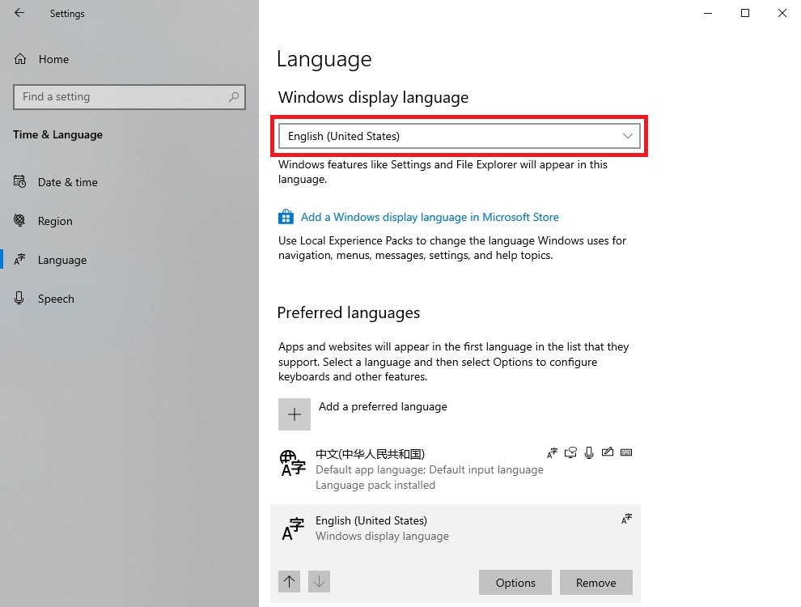
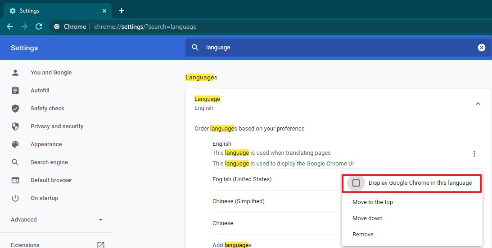

# 更改windows10和Chrome的显示语言

## 为什么要更改显示语言？
+ 为了看english的output。因为windows中很多cli程序都内置了多语言，默认显示的是中文帮助，但中文翻译似乎都是机器翻译的，根本看不懂，更改为显示语言后就可以看到english output了。
+ 如果到论坛提问，只能提供英文截图。
+ 为了更方便跟随官方文档教程，官方文档中的教程截图都是英文的。

## 更改windows10显示语言
+ windows xp、windows 7 都不支持更改显示语言
+ windows 10 中增加了修改显示语言。修改方式：设置-语言-Windows display language-更改为English。如果没有English，需要先安装。

## 更改 Chrome 显示语言
+ 勾选 Display Google Chrome in this language
