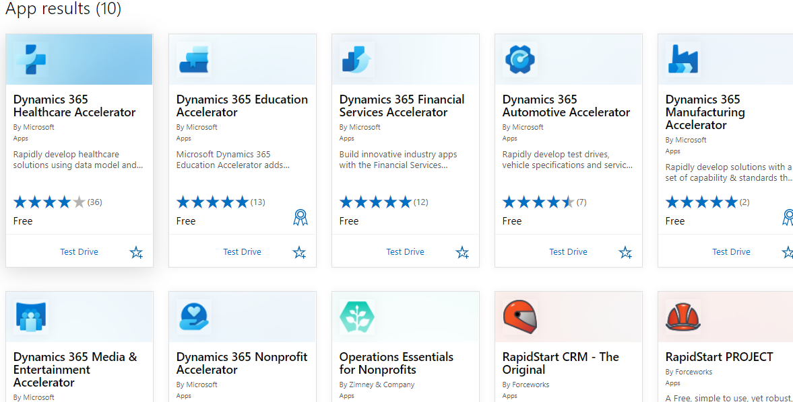

# 附录5 行业加速器 industry accelerator
+ 微软为了推广 Power Platform，特地针对特定行业，开发了行业加速器（industry accelerator）。目的是让开发者直接基于 industry accelerator，节约开发者时间、提升开发效率。
+ industry accelerator提供试用，在appsource中点击`Test Drive`可以直接试用。
+ industry accelerator中提供的内容包括：model-driven app、canvas-apps、Dataverse customizations，还提供了 sample data。这些都以solution的形式提供，可以安装到自己的environment中。
+ 文档`https://docs.microsoft.com/en-us/dynamics365/industry/accelerators/overview`
+ git repo `https://github.com/microsoft/Dynamics-365-Industry-Accelerators`
+ 在appsource中可以看到7个accelerator。`Healthcare Accelerator`于20201231升级为`Microsoft Cloud for Healthcare`，升级后的价格是`95$ per user per month`
+ 

